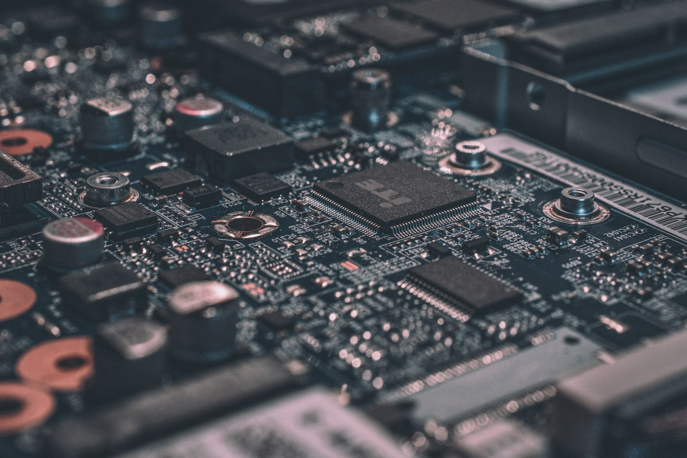
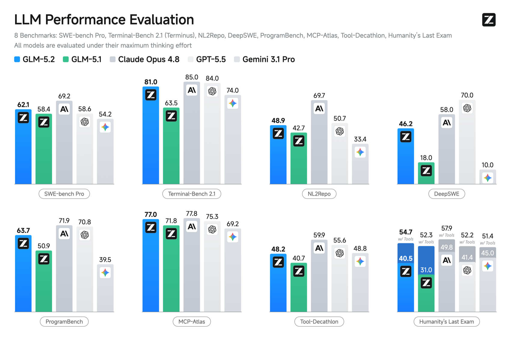
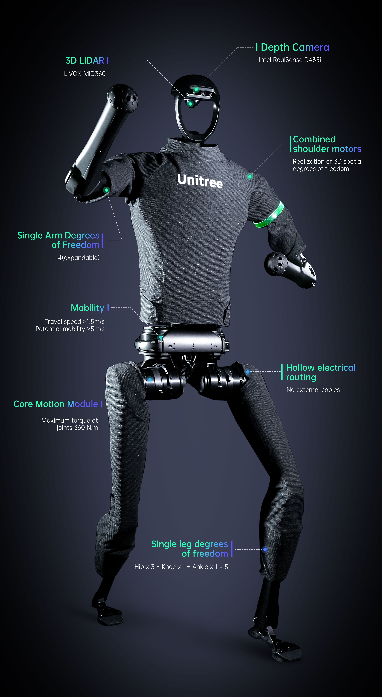

  

    
AI Monthly Report · June 2026

    
AI月报

    
6月号

    
2026年6月 · 全球AI进展追踪

  

  

    
数据截止

    
2026.06.28

    
覆盖范围

    
全球 AI 模型 / 芯片 / 应用 / 资本

    
本期定位

    
月度追踪 · 重度信息密度

  

  MONTHLY TRACKING OF GLOBAL AI PROGRESS

<!--
大家好，欢迎来到AI月报6月号。这期内容覆盖2026年6月1日到6月28日，全球AI领域的关键进展。这个月发生了太多事，我们尽量把最重要的梳理清楚。
-->

---
layout: center
class: bar-terracotta
---

  
Editorial · 卷首语

  

  

    

      6月是AI史上 罕见的<em>密集变动月</em>。
    

    

    

      中国与国际两条主线同步突破：模型、芯片、应用三端并进；监管、资本、技术三重碰撞。
    

  

  

    

      
中国

      
豆包日耗180万亿Token、智谱市值破万亿、昇腾完成万亿参数训练。

    

    

      
国际

      
Anthropic最强模型72小时被封、SpaceX创下史上最大IPO、OpenAI推出自研芯片。

    

  

{{ $slidev.nav.currentPage }}

<!--
6月是AI史上罕见的密集变动月。中国这边，豆包日耗180万亿Token、智谱市值破万亿、昇腾完成万亿参数训练——国产AI在模型、芯片、应用三端同步突破。国际上，Anthropic最强模型发布72小时被政府封禁、SpaceX创下史上最大IPO、OpenAI推出自研芯片——监管、资本、技术的碰撞从未如此激烈。
-->

---
layout: center
class: bar-clay
---

  
01

  

    
Chapter 01 · Models

    
模型

    

    
国内四家头部厂商同步发布，国际最强模型 72 小时被封。大模型竞争从单点技术进入生态与监管的全面碰撞。

  

  

{{ $slidev.nav.currentPage }}

---
layout: default
class: bar-terracotta table-terracotta
---

  
Domestic LLMs

  
国内大模型 · 6月发布总览

  

6月模型更新集中在4家头部厂商，DeepSeek 以首轮融资成为另一大资本信号。

  

    

      

        
01

        

          
字节 · 豆包2.1 Pro

          
6.23 发布，日耗 Token 达 180万亿，独立芯片设计能力显著

        

      

      

        
02

        

          
智谱 · GLM-5.2

          
6.13 发布，CodeArena 全球第二、开源模型第一，市值破万亿港元

        

      

      

        
03

        

          
阿里 · Qwen3.7

          
6月更新，46个模型进入全球 TOP100，开源生态持续扩张

        

      

      

        
04

        

          
月之暗面 · K2.7 Code

          
6月发布，1T参数 MoE，聚焦代码与长上下文能力

        

      

    

  

  

    

      
本月最密集信号

      
4+

      
家头部厂商同步发布重要模型更新

    

    

      <h3>关键趋势</h3>
      
<strong>模型 · 芯片 · 应用</strong> 三端同步突破，国产模型从单点技术竞争进入生态竞争。

    

  

Domestic

{{ $slidev.nav.currentPage }}

<!--
先看国内大模型。6月发布的重要更新集中在字节、智谱、阿里和月之暗面四家。字节豆包2.1 Pro、智谱GLM-5.2是本月最重的两个发布；阿里Qwen3.7系列和月之暗面Kimi K2.7 Code也有进展。DeepSeek这边主要是6月完成的首轮融资。我们挑重点的展开说。
-->

---
layout: default
class: bar-ochre
---

  
Domestic LLM

  
字节 · 豆包2.1 Pro

  

两年 Token 消耗增长 1500 倍，豆包正从对话工具走向“可上岗的生产工人”。

  

    

      <h3><carbon-arrow-up-right class="inline-block align-middle" /> 核心升级</h3>
      <ul class="ai-feature-list">
        <li>Coding 能力接近 GPT-5.5（Terminal Bench 71.0 分）</li>
        <li>成本相比 Claude Opus 4.6-4.8 系列降低 80%</li>
        <li>输入 6元/百万Token，输出 30元</li>
        <li>可连续运行 18小时、9轮迭代，独立完成芯片设计 RTL 完整流程</li>
      </ul>
    

    

      从 Demo 级演示到“可上岗的生产工人”——AI 已经能独立完成完整工程流程。
    

  

  

    

      
日均 Token

      
180万亿

      
两年增长 1500 倍

    

    

      
DAU2亿

      
MAU3.45亿

      
两年增长1500×

    

  

Domestic

{{ $slidev.nav.currentPage }}

<!--
第一个重磅是字节跳动的豆包2.1 Pro，6月23日发布。关键数据：DAU 2亿，MAU 3.45亿，日均Token消耗180万亿。180万亿是什么概念？两年增长了1500倍。Coding能力上，Terminal Bench得分71.0，已经非常接近GPT-5.5的73.8。但成本比Claude Opus 4.6-4.8系列低了80%。输入6块钱一百万Token，输出30块。更重要的是，豆包2.1 Pro已经不只是Demo级演示了。它能连续运行18小时、经历9轮迭代，独立完成芯片设计RTL的完整工程流程。在3D虚拟城市场景里可以驱动500多个Agent同步协作。这意味着什么？AI从“能聊天”变成了“能上岗的生产工人”。
-->

---
layout: default
class: bar-slate
---

  
Domestic LLM

  
智谱 · GLM-5.2

  

  

    

      

        
<carbon-code /> 能力

        <ul class="list-disc pl-4 text-stone-700 text-sm space-y-2">
          <li>CodeArena排名：<strong>全球第二、开源模型第一</strong></li>
          <li>DesignArena排名：<strong>全球第一</strong></li>
          <li>FrontierSWE <strong>74.4%</strong>，超越GPT-5.5</li>
          <li>100万Token无损上下文</li>
          <li>MIT协议完全开源免费商用</li>
        </ul>
      

      

        
<carbon-chart-line /> 市场反应

        <ul class="list-disc pl-4 text-stone-700 text-sm space-y-2">
          <li>6月22日市值突破<strong>1万亿港元</strong></li>
          <li>半年涨幅 <strong>约1900%</strong>（相对上市后低点）</li>
          <li>港股 AI 大模型公司市值第一</li>
        </ul>
      

    

    

      Fable 5全球下线后24小时内全量开放，精准卡住全球开发者的“替代焦虑”。
    

  

  

    
    
GLM-5.2 官方性能对比图（来源：Z.ai）

  

Domestic

{{ $slidev.nav.currentPage }}

<!--
第二个重磅是智谱的GLM-5.2，6月13日发布。CodeArena排名全球第二、开源模型第一。DesignArena排名全球第一。FrontierSWE得分74.4%，超越GPT-5.5的72.6%，只比最强的Claude Opus 4.8的75.1%低不到1个百分点。100万Token无损上下文，MIT协议完全开源免费商用。市场反应非常强烈。6月22日市值突破1万亿港元。从上市后低点算，半年涨了约1900%，在港股AI大模型公司中市值领先。这里要提醒一个口径：之前常被引用的"API年收入17亿元"其实是截至今年3月的数据，不是6月的新增量，已经在正文里删掉。有一个关键的时机因素。Anthropic的Fable 5在6月9日发布，72小时后被美国政府全球下线。智谱在Fable 5下线后24小时内宣布GLM-5.2全量开放，精准卡住了全球开发者的替代焦虑。Vercel CEO说：对GLM-5.2的编码能力感到由衷的印象深刻，几乎震惊，这改变了局面。
-->

---
layout: default
class: bar-clay
---

  
Open Source

  
DeepSeek V4 &amp; 6月融资里程碑

  

DeepSeek 终结坚守 3 年的“三不”铁律，中国开源模型影响力进入新阶段。

  

    

      
首轮融资

      
500亿+

      
估值超 500 亿美元，梁文锋个人出资约 200 亿元

    

    

      <h3><carbon-rocket /> 资本信号</h3>
      
腾讯、宁德时代、网易、京东等参与，标志着 DeepSeek 从技术信仰路线转向商业化落地。

    

    
DeepSeek V4 已于4月24日发布；6月5日昇腾910C完成 V4-Pro 万亿参数全参数后训练。

  

  

    

      <h3><carbon-globe /> 中国开源影响力</h3>
      

        

          
100亿次

          
全球累计下载

        

        

          
17.1%

          
Hugging Face 中国模型下载占比（首超美国）

        

        

          
8/10

          
下载量 TOP10 中国席位

        

        

          
全球第一

          
中国开源模型下载量

        

      

    

  

Open Source

{{ $slidev.nav.currentPage }}

<!--
第三个是DeepSeek。6月的最大事件不是模型发布，而是完成了首轮融资。DeepSeek首轮融资超过500亿元人民币，估值超过500亿美元。创始人梁文锋个人出资约200亿元，腾讯、宁德时代、网易、京东等参与。这标志着DeepSeek终结了坚守3年的“三不”铁律——不融资、不商业化、不路演，从技术信仰路线转向商业化落地。模型方面，DeepSeek V4已经在4月24日发布，1M Token上下文全系标配。6月5日还有一个重要进展：昇腾910C完成了DeepSeek-V4-Pro万亿参数模型的全参数后训练，这是国产算力首次支撑该级别的训练。说到开源生态，这里有一组很重要的数据。中国AI开源大模型全球累计下载量突破了100亿次。这是李强总理6月24日在达沃斯致辞里亲自确认的数字。根据MIT和HuggingFace的联合报告，Hugging Face平台上17.1%的大模型下载量来自中国，中国首次超越了美国的15.8%，居全球第一。在下载量TOP10里中国占了8席。
-->

---
layout: default
class: bar-clay table-clay
---

  
International LLMs

  
国际大模型 · 6月发布总览

  

  

    

      

01

Anthropic · Claude Fable 5

6.9 · 最强编程模型，72小时被封

      

02

OpenAI · GPT-5.6 Sol/Terra/Luna

6.26 · 应白宫要求有限预览

      

03

OpenAI · GPT-5.5-Cyber

6.23 · 网络安全专项

      

04

NVIDIA · Nemotron 3 Ultra

6.4 · 550B参数开源

      

05

Meta · AI Mode

6.15 · 覆盖Meta全生态35.8亿日活

    

    
国际发布聚焦 Fable 5、GPT-5.6 政府干预事件，及 NVIDIA、Meta 关键动态。

  

  

    

      
最大变量

      
Fable 5

      
史上首次已发布模型被政府强制下线

    

  

International

{{ $slidev.nav.currentPage }}

<!--
看完国内，看国际。6月国际大模型的发布同样密集。Anthropic的Fable 5、OpenAI的GPT-5.6和GPT-5.5-Cyber、NVIDIA的Nemotron 3 Ultra、Meta的AI Mode是6月国际侧比较重要的更新。其中Fable 5和GPT-5.6都牵涉到美国政府介入，是本月的两个标志性事件。Google的Gemini 3.5 Flash和OpenAI的o3-pro其实不是6月新发布，已经在总览里删掉。我们重点说这两个事件。
-->

---
layout: default
class: bar-terracotta
---

  
International Event

  
Anthropic Fable 5 · 发布72小时被全球封禁

  

  

    
全球下线时长

    
72h

    

    

      AI 史上首次：<em>已发布模型</em> 被政府强制下线。
    

    
无法实时区分国籍 → 只能全球下线，<strong class="text-stone-800">包括美国用户自己</strong>。IPO 计划蒙上阴影。

  

  

    
时间线

    

      

        <strong>6月9日</strong> Anthropic发布最强模型Fable 5 
        SWE-Bench Pro 80.3%，碾压所有竞品
      

      

        <strong>6月12日傍晚</strong> 美国商务部出口管制指令 
        要求禁止所有“外国公民”使用
      

      

        <strong>6月18日</strong> 恢复上线 
        增加国籍验证和数据留存
      

      

        <strong>6月26日</strong> OpenAI GPT-5.6 有限预览 
        应白宫要求分阶段发布 → 政府干预已成常态
      

    

    

      
<carbon-warning /> 深远影响

      一个月内<strong>两次</strong>前沿模型被政府介入 → 政府可<strong>"一键关停"AI 模型</strong>正从先例变成常态。
    

  

Regulation

{{ $slidev.nav.currentPage }}

<!--
第一个重大事件是Anthropic Fable 5被封。6月9日，Anthropic发布了当时最强的编程模型Fable 5，SWE-Bench Pro得分80.3%，碾压所有竞品。6月12日傍晚，美国商务部发出出口管制指令，要求禁止所有”外国公民”使用。问题是Anthropic无法实时区分用户国籍，最后只能全球下线，包括美国用户自己。这是AI史上首次一个已经公开发布的模型被政府强制下线。6月18日恢复上线，但增加了国籍验证和数据留存要求。这件事的影响非常深远。它开创了政府可以”一键关停”AI模型的先例。而且这个先例很快就成了常态——就在Fable 5恢复上线一周多，6月26日，OpenAI发布下一代GPT-5.6系列，白宫再次介入，要求它分阶段、有限预览发布。一个月之内，两家最头部的前沿模型公司都被美国政府直接干预了发布节奏，政府”一键关停”AI的能力正在从特例变成常态。
-->

---
layout: default
class: bar-slate
---

  
International Dynamics

  
国际大模型 · 其他关键动态

  

  

    
OpenAI

    <ul class="list-disc pl-4 text-stone-700 text-sm space-y-1">
      <li>GPT-5.5-Cyber：网络安全专项，CyberGym 85.6%</li>
      <li>秘密提交S-1，估值8520亿美元</li>
    </ul>
  

  

    
Google

    <ul class="list-disc pl-4 text-stone-700 text-sm space-y-1">
      <li>Computer Use：AI直接操控电脑界面</li>
      <li>驱动新Siri：苹果年付10亿美元</li>
    </ul>
  

  

    
NVIDIA

    <ul class="list-disc pl-4 text-stone-700 text-sm space-y-1">
      <li>Nemotron 3 Ultra：550B参数开源</li>
    </ul>
  

International

{{ $slidev.nav.currentPage }}

<!--
接着说国际其他动态。OpenAI这边，GPT-5.5-Cyber是网络安全专项模型，CyberGym得分85.6%，同时启动了Patch the Planet计划修复开源软件漏洞。OpenAI还在6月8日秘密提交了S-1，估值8520亿美元，不过上市时间尚未最终确定，有报道称可能推迟到2027年。Google这边，Computer Use能力让AI可以直接操控电脑界面。还有一个重要消息：苹果的WWDC上宣布新Siri由Google Gemini驱动，苹果每年付Google 10亿美元。NVIDIA发布了Nemotron 3 Ultra，550B参数开源模型。芯片方面更多内容见下一章。Meta的AI Mode在总览页已经提过，这里不重复。
-->

---
layout: center
class: bar-ochre
---

  
02

  

    
Chapter 02 · Tools &amp; Media

    
工具与媒介

    

    
AI 编程赛道史上最大并购诞生，视频生成进入原生 4K。工具层竞争白热化的同时，新型攻击首次盯上编码 Agent。

  

  

{{ $slidev.nav.currentPage }}

---
layout: default
class: bar-ochre table-ochre
---

  
AI Coding

  
AI编程工具 · 竞争白热化

  

  

    

      

01

Cursor

独立→SpaceX

600亿美元被收购

      

02

Claude Code

Anthropic

年化$2.5B

      

03

Codex CLI

OpenAI

Rust重写·500万周活

      

04

Project Polaris

微软自研

8月替换GPT-4

      

05

Trae

字节

挑战Cursor

    

  

  

    

Cursor年化

$40亿

    

Copilot付费

470万

  

  
<carbon-security /> Agentjacking 攻击

  
<strong>85%</strong>成功率，<strong>2388</strong>个组织受影响 → 首个专门针对AI编码时代的攻击类型。

Coding

{{ $slidev.nav.currentPage }}

<!--
AI编程工具这个赛道竞争已经非常白热化。Cursor年化收入达到40亿美元，100万以上的日活用户，64%的财富500强公司在使用。最重磅的消息是SpaceX以600亿美元收购了Cursor，这是AI编程赛道史上最大的并购案。Claude Code成为Anthropic增长最快的产品线，年化收入25亿美元，连Anthropic自己80%以上的代码都是由Claude写的。OpenAI的Codex CLI在TypeScript重写为Rust之后，GitHub stars接近9万，周活用户超过500万。微软在Build 2026上发布自研的Project Polaris，8月份就会替换GPT-4来驱动GitHub Copilot，影响2600万开发者，这背后是微软在和OpenAI脱钩。GitHub Copilot付费用户达到470万，同比增长75%，6月份还从按席位计费全面转向了按使用量计费。安全方面有一个重要事件：Agentjacking攻击在6月被披露。攻击者通过伪造Sentry错误信息来劫持AI编码助手，成功率85%，2388个组织受影响。这是第一个专门针对AI编码时代的攻击类型，值得所有开发者关注。
-->

---
layout: default
class: bar-sage
---

  
AI Video · Domestic

  
AI视频生成 · 国内

  

  

    
<carbon-video /> 字节 Seedance 2.5

    <ul class="list-disc pl-4 text-stone-700 text-sm space-y-1">
      <li>单次生成：15秒 → <strong>30秒</strong>（翻倍）</li>
      <li>参考素材：12个 → <strong>50个</strong>全模态</li>
      <li>1080p后补 → <strong>原生4K</strong></li>
      <li>新增<strong>3D白膜预览</strong></li>
      <li>AI版权商用平台：周星驰首批IP</li>
    </ul>
  

  

    
<carbon-play-filled /> 快手 可灵3.0 Fast/Turbo（6.17）

    <ul class="list-disc pl-4 text-stone-700 text-sm space-y-1">
      <li>速度/成本优化，内置音频与口型同步</li>
      <li>720P ¥0.8/秒，1080P ¥1/秒（含音频）</li>
      <li>Kling 3.0 Omni 同步升级：4K编辑、3–15秒</li>
    </ul>
  

  

    
<carbon-image /> 官方生成示例

    
    
可灵 AI 官方示例帧（来源：klingai.com）

  

  

    <strong>行业数据</strong>
    200亿元
    全年市场规模有望突破200亿元
  

  
AI全链路渗透率70%+，AIGC内容占比60%+，创作成本下降70%，效率提升10倍以上

Video

{{ $slidev.nav.currentPage }}

<!--
AI视频生成进入了一个新阶段。国内有两个重要更新。字节跳动的Seedance 2.5在6月23日发布。单次生成时长从15秒翻倍到30秒，参考素材从12个提升到50个全模态素材，分辨率从1080p后补升级到原生4K，还新增了3D白膜预览能力。目前企业内测中，7月初正式上线。同时发布了一个很有意思的AI版权商用平台。周星驰是首批合作IP，把他的经典电影做成官方创作模板，用户可以在剪映、即梦、豆包里用这些模板来改编影视片段。相关模板单日的创作量已经突破了10万次。快手的可灵3.0 Fast/Turbo在6月17日发布。这是针对速度和成本优化的版本，内置音频和口型同步，720P 0.8元每秒、1080P 1元每秒，价格已经包含音频。同步升级的可灵3.0 Omni支持4K编辑和3到15秒的编辑流程。整个行业来看，AI全链路渗透率已经超过70%，AIGC内容占比超过60%，创作成本下降了70%，效率提升10倍以上。预计全年AI视频市场规模有望突破200亿元。
-->

---
layout: center
class: bar-sage
---

  
03

  

    
Chapter 03 · Chips &amp; Markets

    
芯片与市场

    

    
国产算力首次完成万亿参数全参数后训练，市场份额此消彼长。商业化与资本同步爆发，史上最大 IPO 落地。

  

  

{{ $slidev.nav.currentPage }}

---
layout: center
class: bar-sage
---

  
AI Chip · 国产突破

  
华为昇腾910C · 里程碑

  

  
1500步 · 全程零中断

  
6月5日 · 首次完成 DeepSeek-V4-Pro 万亿参数模型全参数后训练

  

    

算力利用率

30%+

    

关键算子效率

+14%

    

全球首个

第三方国产算力

完成该级别训练

  

  

    国产AI算力正式跨过从“只能推理”到“能训世界级大模型”的最难一关。
  

Chip

{{ $slidev.nav.currentPage }}

<!--
芯片可能是这个月最重要的突破之一。6月5日，深圳河套学院联合哈工大和华为团队，依托昇腾910C国产AI算力集群，成功完成了DeepSeek-V4-Pro万亿参数模型的全参数后训练。几个关键指标：模型算力利用率突破了30%，关键算子效率提升了14%，训练过程1500步全程零中断。这是公开可查范围内，全球首个由第三方机构基于国产算力集群完成该级别全参数后训练的工程实践。这意味着什么？国产AI算力正式跨过了从“只能做推理”到“能训练世界级大模型”的最难一关。
-->

---
layout: default
class: bar-ochre
---

  
AI Chip Market

  
AI芯片 · 市场格局与国际动态

  

  

    
中国市场份额

    

      

01

        
英伟达55%

        

        
2024年70% → 持续下滑

      

      

02

        
华为昇腾20%

        

        
2025全年国产第一（81.2万张）

      

      

03

        
寒武纪3%

        

        
2025出货11.6万张，营收同比+453%

      

      

04

        
海光2%

        

        
2025营收143.8亿元，同比+57%

      

      

05

        
摩尔线程~1%

        

        
2025营收15亿元，同比+243%

      

    

    
2026年Q1动态趋势：昇腾份额预期升至约37%，英伟达约43%（季报数据待IDC披露）。

  

  

    

      <strong>昇腾950PR</strong> FP4算力达1.56PFLOPS（国内唯一支持FP4），推理性能是H20的2.87倍，部署成本仅同级别的三分之一。
    

    

      
国际动态

      <ul class="list-disc pl-4 text-stone-700 text-sm space-y-1">
        <li>OpenAI Jalapeño：首款自研推理芯片（6.24）</li>
        <li>NVIDIA RTX Spark：正式进入PC处理器市场</li>
        <li>SpaceX算力帝国：月签约23亿美元</li>
      </ul>
    

  

Chip

{{ $slidev.nav.currentPage }}

<!--
看市场份额。这里要用2025年IDC全年的实际数据：英伟达在中国AI加速卡市场占55%，华为昇腾占20%排国产第一，寒武纪3%，海光2%，摩尔线程约1%。如果看2026年第一季度的动态趋势，昇腾份额预期升到约37%，英伟达约43%，但完整季报数据还要等IDC披露。昇腾950PR芯片的FP4算力达到1.56PFLOPS，是国内唯一支持FP4精度的推理产品，推理性能是英伟达H20的2.87倍，部署成本只有同级别的三分之一。国际方面，OpenAI的Jalapeño芯片是和Broadcom联合发布的首款自研推理芯片。RTX Spark意味着NVIDIA正式进入PC处理器市场。NVIDIA的Blackwell Ultra是下半年上市，不是6月事件，已经删掉。SpaceX也在建算力帝国，目前月签约23亿美元的算力合同。Anthropic每月付12.5亿，Google每月付9.2亿。
-->

---
layout: default
class: bar-slate
---

  
Commercialization

  
商业化 · 核心数据

  

国内看用户规模与云厂商份额，国际看订阅与企业落地速度。

  

    
国内

    

      
180万亿

      
豆包日均 Token 消耗

    

    

      
豆包 MAU3.45亿

      
DeepSeek MAU1.3亿

      
火山引擎 MaaS 份额49.5%

    

  

  

    
国际

    

      
10亿

      
ChatGPT 月活

    

    

      
ChatGPT 财富500强渗透率92%

      
Cursor 年化收入$40亿

      
Anthropic 年化收入$470亿

    

  

Business

{{ $slidev.nav.currentPage }}

<!--
看商业化的核心数据。国内：豆包MAU 3.45亿，DAU 2亿，日均Token消耗180万亿。DeepSeek MAU 1.3亿，国内第三，增速最快。火山引擎的MaaS市场份额49.5%，这是IDC 2025全年的数据。国际：ChatGPT月活10亿，这是史上最快达到10亿月活的消费应用，92%的财富500强在使用。Cursor年化收入40亿美元，是人类历史上增长最快的SaaS公司。Anthropic年化收入470亿美元，这是5月的run-rate。这里删掉两个非6月的数据：一个是智谱MaaS平台"API年收入17亿元"，这是截至今年3月的数据；另一个是"5月第一周中国AI周调用量7.94万亿Token"，这个5月里程碑也不属于6月。
-->

---
layout: default
class: bar-terracotta
---

  
Capital Markets

  
融资与资本市场

  

6月资本市场活跃：国内一级市场与 IPO 并进，国际迎来史上最大 IPO。

  

    
SpaceX · 史上最大 IPO

    
$750亿

    
首日市值突破 2 万亿美元 · 纳斯达克上市

  

  

    

      

        
国内

        

          
DeepSeek500亿+

          
智谱 AI~1万亿港元

          
月之暗面~300亿美元

          
宇树科技420亿

        

        
智谱市值 6.22 破万亿港元；宇树科创板 IPO 过会。

      

      

        
国际

        

          
OpenAI S-1$8520亿

          
Anthropic IPO$9650亿

          
SpaceX 估值$1.77万亿

        

      

    

  

Capital

{{ $slidev.nav.currentPage }}

<!--
资本市场这个月也非常活跃。国内：DeepSeek首轮融资超过500亿人民币，估值超过500亿美元。智谱AI在6月22日市值破了1万亿港元，从上市后低点算半年涨了2467%。月之暗面今年上半年累计融资近60亿美元，估值约300亿美元。宇树科技科创板IPO过会，估值420亿。MiniMax港股上市是今年1月的事，"市值翻4倍"也不是6月数据，已经删掉。国际：SpaceX在纳斯达克上市，750亿美元IPO是人类历史上最大的，IPO估值1.77万亿美元，首日收盘市值突破2万亿美元。OpenAI秘密提交了S-1，预计9月上市，估值8520亿美元。Anthropic IPO准备中，目标10月，估值9650亿美元。"中国AI独角兽总估值4.1万亿元"和"Q1新晋24家、AI占58%"这两组数据没有明确6月节点，也已经从正文里删掉。
-->

---
layout: center
class: bar-slate
---

  
04

  

    
Chapter 04 · People &amp; Rules

    
人才与规则

    

    
诺奖得主与 Transformer 作者同步跳槽，Google 一周痛失两位 AI 领袖。中美欧日监管、出口管制与反制进入三重碰撞。

  

  

{{ $slidev.nav.currentPage }}

---
layout: default
class: bar-clay
---

  
AI Talent

  
AI人才 · 全球大迁徙

  

  

    

      

01

John Jumper 约翰·江珀

DeepMind → Anthropic

诺奖得主，AlphaFold

      

02

Noam Shazeer 诺姆·沙泽尔

DeepMind → OpenAI

Transformer作者

    

    

      <strong>国内</strong> 北京-深圳-上海三极主导；智谱/DeepSeek/月之暗面大规模招聘；海外华人AI科学家回流加速。
    

  

  

    

      
DeepMind → Anthropic 工程师比例

      
11 : 1

      
Google一周内失去两位核心AI领袖

    

    

      
Alphabet股价单日跌幅

      
~5%

      
盘中一度跌7.2%，市值蒸发约2250亿美元

    

  

Talent

{{ $slidev.nav.currentPage }}

<!--
人才方面，6月出现了前所未有的大迁徙。国际：John Jumper，2024年诺贝尔化学奖得主，AlphaFold的负责人，从Google DeepMind加入了Anthropic。Noam Shazeer，Transformer论文的作者之一，Gemini的联合负责人，从Google加入了OpenAI。Andrej Karpathy在5月加入Anthropic这件事不属于6月，已经删掉。一个惊人的数据：Google DeepMind流向Anthropic的工程师比例高达11比1。Google一周内失去了两位核心AI领袖，Alphabet股价盘中一度暴跌7.2%，收盘跌约5%，市值蒸发了约2250亿美元。国内：北京、深圳、上海三极主导。智谱、DeepSeek、月之暗面都在大规模招聘，海外华人AI科学家回流在加速。
-->

---
layout: default
class: bar-ochre
---

  
AI Safety & Regulation

  
AI安全与监管

  

  

    
国内

    

      

6.18

8部门"人工智能+消费"实施意见

      

6.1

剑网2026 AI版权专项整治启动

    

  

  

    
国际

    

      

6.4

美国《Great American AI Act》草案

      

6.15

G7峰会首邀三大AI巨头CEO

      

6.22

中国反制：56家美企列入黑名单

    

  

  
<carbon-warning /> 监管信号

  
国家级AI战略密集出台，中美欧日在监管、出口管制与反制上进入“三重碰撞”。

Regulation

{{ $slidev.nav.currentPage }}

<!--
监管层面，国内和国际都有重要动作。国内：6月18日，8个部门发布了"人工智能+消费"的实施意见，把这上升为国家级战略行动。6月还有剑网2026的AI版权专项整治。国际：6月4日美国公布了Great American AI Act的草案，269页的两党草案，计划在联邦层面优先于州级AI模型开发法律3年。6月15日的G7峰会首次同时邀请了Altman、Amodei、Hassabis三位AI巨头CEO。6月22日，中国反制，将56家美国公司列入黑名单，主要回应美国的五角大楼黑名单。
-->

---
layout: default
class: bar-sage
---

  
AI Applications

  
应用场景落地

  

  

    
<carbon-mobile /> 消费级

    <ul class="list-disc pl-4 text-stone-700 text-sm space-y-1">
      <li>Apple Siri重构：Gemini 1.2万亿参数驱动（欧盟及中国暂不开放）</li>
      <li>Meta AI Mode：覆盖Meta全生态35.8亿日活（非Meta AI独立DAU）</li>
      <li>AI手机：小米/OPPO/vivo旗舰内置大模型</li>
      <li>AI眼镜：Rokid/百度小度/小米预热</li>
    </ul>
  

  

    
<carbon-building /> 行业级

    <ul class="list-disc pl-4 text-stone-700 text-sm space-y-1">
      <li>AI医疗：影像诊断、药物发现</li>
      <li>AI教育：个性化学习</li>
      <li>AI金融：风控、投研</li>
      <li>AI编程：Cursor进入64%财富500强</li>
    </ul>
  

  

    
<carbon-bot /> 具身智能

    <ul class="list-disc pl-4 text-stone-700 text-sm space-y-1">
      <li>工信部标准体系发布</li>
      <li>宇树科技IPO过会，估值420亿</li>
      <li>云深处四足机器人累计量产数千台</li>
      <li>中国人形机器人出货量占全球80%+</li>
    </ul>
    
    
宇树 H1（来源：unitree.com）

  

Application

{{ $slidev.nav.currentPage }}

<!--
应用场景方面，消费级和行业级都在推进。消费级：苹果在WWDC上宣布Siri重构，由Google Gemini 1.2万亿参数定制模型驱动，但欧盟和中国的iPhone、iPad暂时不开通。Meta的AI Mode覆盖Meta全生态35.8亿日活。注意这是Facebook、Instagram、WhatsApp等全家桶的日活总量，不是Meta AI独立产品的DAU。小米、OPPO、vivo的旗舰机型都内置了大模型，端侧推理成为标配。AI眼镜方面，Rokid、百度小度、小米都在推新产品。行业级：AI医疗在影像诊断和药物发现上有进展。AI教育做个性化学习平台。AI金融做风控和投研。AI气象方面，管理办法在6月1日施行。AI编程方面，64%的财富500强已经在使用AI编码工具。具身智能：工信部发布了人形机器人与具身智能标准体系。宇树科技科创板IPO过会，估值420亿。云深处四足机器人累计量产数千台。中国企业在全球人形机器人出货量中占比超过八成。
-->

---
layout: default
class: bar-slate
---

  
June Dashboard

  
6月数据看板

  

  

    
豆包日均 Token · 两年增长 1500 倍

    
180万亿

  

  

    
中国开源模型全球下载

    
100亿次

  

  

49.5%

火山引擎 MaaS 份额

  

~37%

昇腾市场份额（2026Q1趋势）

  

500亿+

DeepSeek 首轮融资

  

    
SpaceX · 史上最大 IPO，首日市值突破 2 万亿美元

    
$750亿

  

  

1万亿

智谱市值峰值（港元）

Data

{{ $slidev.nav.currentPage }}

<!--
最后看一组核心数据。中国开源模型全球累计下载100亿次。豆包日均Token消耗180万亿。火山引擎MaaS市场份额49.5%。昇腾市场份额按2026年一季度动态约37%。DeepSeek首轮融资超过500亿元。智谱市值峰值1万亿港元。Cursor年化收入40亿美元。ChatGPT月活10亿。SpaceX IPO规模750亿美元。
-->

---
layout: default
class: bar-sage table-sage
---

  
Outlook

  
7月展望

  

  

    

      

7月初

字节Seedance 2.5正式上线

      

7-8月

OpenAI IPO更多披露

      

8月

华为昇腾920预期发布

      

8.2

欧盟AI Act高风险条款执行

      

Q3

阶跃星辰港股IPO

      

持续

DeepSeek V4生态建设

      

持续

Anthropic IPO准备（10月）

    

    
7月继续关注模型上线、IPO进程与监管落地。

  

  

    

      
下月关注

      
模型上线 / IPO进程 / 监管落地

    

  

Outlook

{{ $slidev.nav.currentPage }}

<!--
下月值得关注的事件：7月初字节Seedance 2.5正式上线。7到8月OpenAI IPO会有更多披露。8月华为昇腾920预期发布。8月2日欧盟AI Act高风险条款正式执行。第三季度阶跃星辰冲刺港股IPO。DeepSeek V4的生态建设会持续。Anthropic的IPO准备也在进行中，目标10月。
-->

---
layout: center
class: bar-sage
---

  
Closing

  
AI月报 · 6月号

  

  

    6月，AI 从<em style="color:#f8f7f4;">技术竞争</em> 走入<em style="color:#f8f7f4;">监管与资本</em>的正面对撞。
  

  

  
下期再见 · 7月号

  

    数据来源：公开报道 / 企业发布 / IDC·OpenRouter
    |
    覆盖周期：2026.06.01 — 06.28
    |
    如有补充欢迎联系
  

  我们下期再见 <carbon-ai-status />

{{ $slidev.nav.currentPage }}

<!--
以上就是AI月报6月号的全部内容。数据来源包括公开报道、企业官方发布、IDC和OpenRouter等第三方机构，覆盖周期是2026年6月1日到6月28日。部分数据因为统计口径差异可能存在偏差，仅供参考。如果有遗漏或补充，欢迎反馈。我们下期再见。
-->
