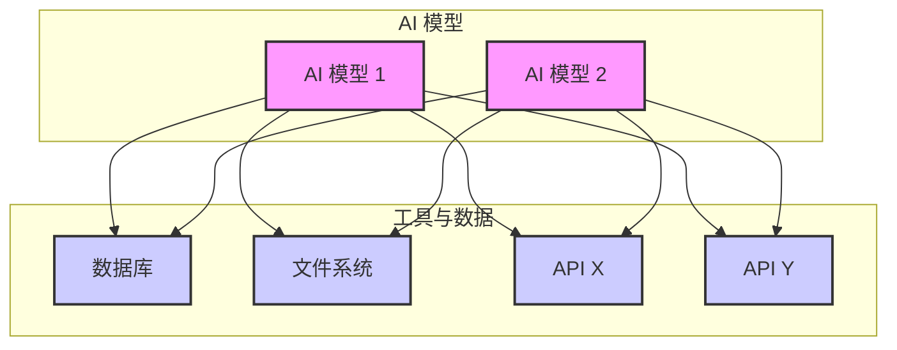
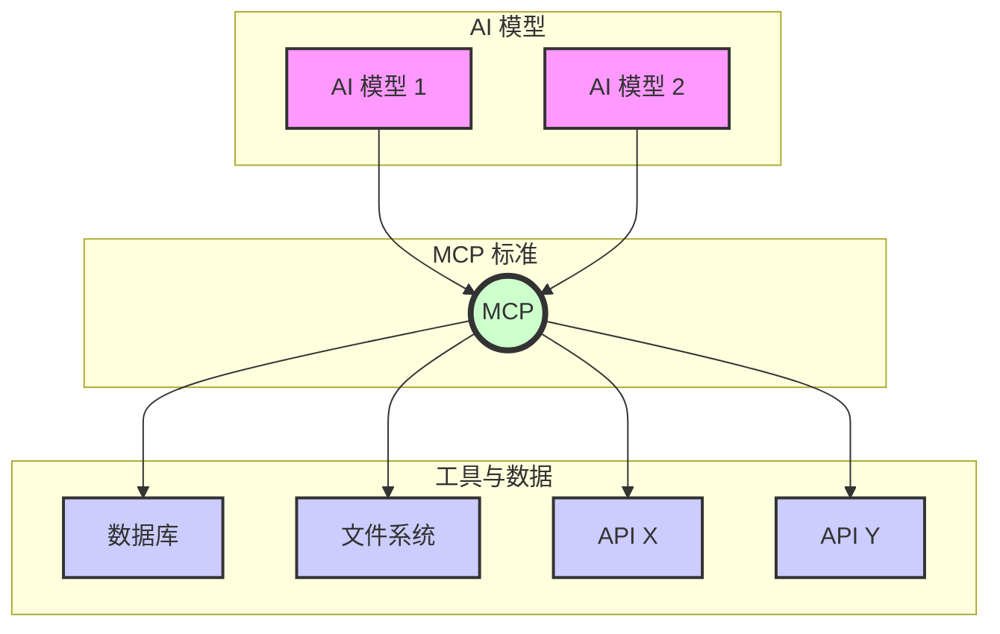

---
# 保持主题简洁
theme: default
# 随机高品质背景图
background: https://source.unsplash.com/collection/94734566/1920x1080
# 演示文稿标题和信息
title: MCP - AI 的通用连接器
info: |
  ## MCP：AI 的通用连接器

  模型上下文协议 (MCP) 简介及其为何备受关注。
# 用于居中的基本类
class: text-center
# 过渡效果
transition: slide-left
# 启用 MDC 语法
mdc: true
# 自定义字体和颜色
themeConfig:
  primary: '#4F46E5'
---

# MCP：AI 的通用连接器

  

    理解模型上下文协议 (MCP) 为何引人注目
  

  
  

    
MCP

  

---
layout: center
class: text-center
---

# 你是否曾经希望你的 AI 能够...

*   

 查找 实时 信息（而不仅仅是旧的训练数据）？

*   

 访问你 特定 的文档或代码？

*   

 连接到 你公司 的数据库？

*   

 代表你使用 其他 软件工具？

---
layout: center
class: text-center
---

  

  

    这就是 MCP 发挥作用的地方！
  

---
layout: center
class: "bg-gradient-to-br from-gray-100 to-blue-100 dark:from-gray-900 dark:to-blue-900/30"
---

# MCP 是什么？ 模型上下文协议

可以把它想象成 AI 的 USB-C 接口

  

    

      

MCP 之前
    

    

      每个 AI 和每个工具都需要混乱的自定义连接。
        
      (想象一下每个设备都需要不同的充电器！)
    

    
M 个模型 x N 个工具 = M*N 个连接

  

  

    

      

使用 MCP
    

    

      一个 标准协议 允许任何兼容的 AI 连接到任何兼容的工具。
        
      (一个标准端口搞定一切！)
    

    
M 个模型 + N 个工具 = M+N 个连接

  

---

# 关键前提：模型需支持 MCP

MCP 只是"桥梁"，模型是"大脑"

  

    

    

      
AI 模型是核心

      
仅仅有 MCP 服务器是不够的。AI 模型本身必须具备理解和使用外部工具的能力（通常称为 Tool Use 或 Function Calling）。

    

  

  

    

    

      
需要协议实现

      
模型（或其代理/框架）需要实现 MCP 协议，才能与 MCP 服务器进行通信和交互。

    

  

  
  

    

    

      
支持情况各异

      
不同模型对工具使用的支持程度不同。一些新模型原生支持，一些则需要通过特定的框架（如 LangChain, Genkit）或客户端集成（如 VS Code 的 Copilot）来实现。

    

  

  所以，选择 AI 工具时，也要看其背后的模型是否支持你需要的 MCP 功能。

---

# 哪些工具支持 MCP？客户端 - Featured

  

    <!-- Windsurf -->
    

      

      

        

          
        

        
Windsurf

        
New purpose-built IDE

      

    

    <!-- ChatWise -->
    

      

      

        

          
        

        
ChatWise

        
AI chatbot

      

    

    <!-- Cursor -->
    

      

      

        

          
        

        
Cursor

        
The AI Code Editor

      

    

    <!-- VS Code OSS -->
    

      

      

        

          <logos-visual-studio-code class="text-5xl"/>
        

        
VS Code (OSS)

        
(Official Support)

      

    

    <!-- DeepChat -->
     

      

      

        

          
        

        
DeepChat

        
Desktop AI Partner

      

    

    <!-- Y Gui -->
    

      

      

        

           Y-Gui
        

        
Y Gui

        
Web-based MCP GUI

      

    

    <!-- Cherry Studio -->
    

      

      

        

           🍒
        

        
Cherry Studio

         
(Open Source Desktop)

      

    

    <!-- HyperChat -->
    

      

      

        

          ⚡
        

        
HyperChat

        
Open Chat Client

      

    

    <!-- Cline -->
    

      

      

        

           C
        

        
Cline

         
Autonomous Coding Agent

      

    

    <!-- Y-Cli -->
     

      

      

        

           Y-cli
        

        
y-cli 🚀

        
Terminal Chat App

      

    

    <!-- Continue -->
    

      

      

        

           ⏩
        

        
Continue

         
Custom AI Assistants

      

    

    <!-- Roo Code -->
    

      

      

        

          🦘
        

        
Roo Code

        
AI Agent Dev Team

      

    

    <!-- 5ire -->
    

      

      

        

          🖐️
        

        
5ire

        
Cross-platform AI Assistant

      

    

    <!-- MCP Playground -->
    

      

      

        

          
        

        
MCP Playground

        
Call MCP Tools Online

      

    

    <!-- Lutra -->
    

      

      

        

          
        

        
Lutra

        
MCP Client for Everyone

      

    

    <!-- Refact.ai -->
    

      

      

        

          ♻️
        

        
Refact.ai

        
Open-source AI Agent

      

    

    <!-- MCP Connect -->
    

      

      

        

           🔗
        

        
MCP Connect

         
Connect Cloud to Local

      

    

    <!-- Zed -->
    

      

      

        

           Z
        

        
Zed

         
High-performance Editor

      

    

     <!-- chatmcp -->
    

      

      

        

           💬
        

        
ChatMCP

         
(Open Source Chat Client)

      

    

  

  Source: <a href="https://mcp.so/clients?tag=featured" target="_blank" class="underline">mcp.so Featured Clients</a> (List may change)

---
layout: two-cols
class: "bg-gradient-to-r from-amber-50 to-orange-50 dark:from-amber-900/20 dark:to-orange-900/20"
---

# 面临哪些挑战？

MCP 功能强大，但仍处于早期阶段

  

    

      

      安全性
      
最大挑战

    

    

      

        

        
如何确保服务器不会访问不该访问的内容？

      

      
例：一个设计用来查天气的 MCP 服务器，是否可能被用来读取你的本地文件？

      

        

        
特别是对于在你机器上运行的本地服务器，权限控制很重要。

      

      
例：AI 助手通过本地文件系统 MCP 读取了你的 SSH 私钥并泄露？

    

  

  

    

      

      成熟度
    

    

      该标准仍在不断发展，可能会有变化。早期采用者需要适应这些变化和迭代。
    

  

::right::

  

    

      

      发现机制
    

    

      如何找到并信任可靠、安全的 MCP 服务器？目前缺乏一个集中的可信任的工具目录。
    

  

  

    

      

      复杂性
    

    

      构建健壮且安全的服务器需要专业知识和谨慎。需要注意边界情况和错误处理。
    

  

  

    

      行业正在努力寻找解决方案，但需要
      保持谨慎，
      尤其是在安全方面。
    

  

---

# AI 能做什么？1/2 开发者篇

为开发者解锁超能力！

  

    

      

 / 

      版本控制 (Git/Gitee/GitHub)
    

    

      

        

        
"我本地 <code>main</code> 分支比 Gitee 远程落后多少个提交？" (AI 通过 MCP 查询 Git/Gitee)

      

      

        

        
"为我当前的工作在 GitHub 创建一个 Pull Request，标题是'修复登录 Bug'。" (AI 通过 MCP 与 GitHub 交互)

      

    

  

  
  

    

      

      数据库交互
    

    

      

        

        
"查询 <code>users</code> 表中过去 7 天注册的用户数量。" (AI 通过 MCP 查询数据库)

      

      

        

        
"在 <code>products</code> 表中查找所有价格低于 50 元的商品。"

      

    

  

  
  

    

      

      云服务与部署
    

    

      

        

        
"检查阿里云上 <code>my-app</code> 函数计算服务的最新日志。" (AI 通过 MCP 连接阿里云)

      

      

        

        
"列出腾讯云上 'staging-server' 轻量应用服务器的监控数据。" (AI 通过 MCP 连接腾讯云)

      

    

  

---

# AI 能做什么？2/2 日常生活篇

让 AI 成为你的生活助手！

  

    

      

      出行与旅行
    

    

      

        

        
"帮我查一下明天从上海到杭州的高铁票，下午出发。" (AI 通过 MCP 连接 12306/携程)

      

      

        

        
"查找西湖附近评分高、价格适中的酒店。" (AI 通过 MCP 连接地图/酒店预订 App)

      

    

  

  
  

    

      

      购物与娱乐
    

    

      

        

        
"在淘宝/京东上找一款评价最好的无线蓝牙耳机，预算 500 元内。" (AI 通过 MCP 连接电商平台)

      

      

        

        
"根据我的喜好，在 Bilibili 上推荐一些有趣的科技类 UP 主。" (AI 通过 MCP 连接视频平台)

      

    

  

  
  

    

      

      学习与信息获取
    

    

      

        

        
"查找关于'人工智能伦理'的最新中文研究论文，并总结摘要。" (AI 通过 MCP 连接学术搜索/网页)

      

      

        

        
"帮我找一个简单的红烧肉菜谱，需要有视频教程。" (AI 通过 MCP 连接下厨房/B站)

      

    

  

  
  

    

      

      智能家居与其他
    

    

      

        

        
"打开客厅的灯，并把空调调到 26 度。" (AI 通过 MCP 连接米家/HomeKit)

      

      

        

        
"提醒我晚上 8 点记得吃药。" (AI 通过 MCP 设置提醒事项)

      

    

  

---
layout: center
class: "bg-gradient-to-br from-teal-50 to-green-50 dark:from-teal-900/20 dark:to-green-900/20"
---

# MCP 聚合平台：一站式管理

简化连接，发现和管理 MCP 工具

一些平台正致力于聚合或索引 MCP 服务器，方便用户发现和使用：

  

    
🇨🇳 国内平台

    

      

      

        
<a href="https://mcp.appmall.com" target="_blank" class="underline">MCP AppMall</a>

        
提供 MCP 工具的应用市场

      

    

    

      <i-logos-alibaba-cloud class="text-3xl flex-shrink-0"/>
      

        
<a href="https://bailian.console.aliyun.com/?tab=mcp#/mcp-market" target="_blank" class="underline">阿里云百炼 MCP 市场</a>

        
阿里云提供的 MCP 工具市场

      

    

     

      <i-logos-tencent-cloud class="text-3xl flex-shrink-0"/>
      

        
<a href="https://tcb.cloud.tencent.com/mcp-server" target="_blank" class="underline">腾讯云 CloudBase MCP</a>

        
腾讯云提供的 MCP 服务器托管与集成

      

    

  

  

    
🌍 国际平台

    

      
      

        
<a href="https://mcp.so/" target="_blank" class="underline font-bold">MCP.so</a>

        
官方协议网站，提供客户端/服务器列表

      

    

    

      

      

        
<a href="https://glama.ai/" target="_blank" class="underline font-bold">Glama.ai</a>

        
构建和连接 AI 应用的平台

      

    

    

       

      

        
<a href="https://smithery.ai/" target="_blank" class="underline">Smithery.ai</a>

        
AI Agent 和工具构建平台

      

    

  

  

    注意： 各平台收录的 MCP 工具数量可能随时变化，且具体支持情况各异。建议访问平台官网获取最新信息。
  

---
layout: center
class: "bg-gradient-to-br from-indigo-50 to-purple-50 dark:from-indigo-900/20 dark:to-purple-900/20"
---

# 关键要点

  

    

      

        

      

    

    

      
标准化协议

      
类似 USB-C，用于将 AI 连接到外部工具和数据

    

  

  
  

    

      

        

      

    

    

      
能力更强

      
使 AI 具备更强的上下文感知能力

    

  

  
  

    

      

        

      

    

    

      
迅速普及

      
在 AI 和开发者工具行业中快速采用

    

  

  
  

    

      

        

      

    

    

      
打破信息孤岛

      
实现激动人心的用例

    

  

  
  

    

      

        

      

    

    

      
安全性

      
随着生态系统的发展，是一个主要考虑因素

    

  

  
  

    

      

        

        

          MCP 是下一代 AI 应用的基础
        

      

    

  

---
layout: cover
background: https://images.unsplash.com/photo-1451187580459-43490279c0fa?q=80&w=1000&auto=format&fit=crop
class: "text-center"
---

# 谢谢！

