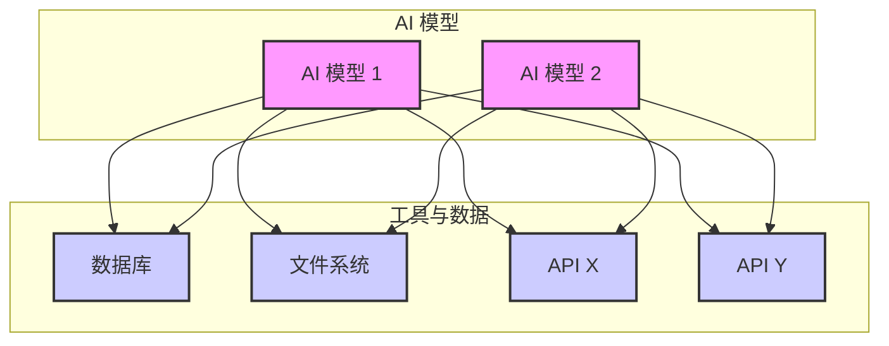
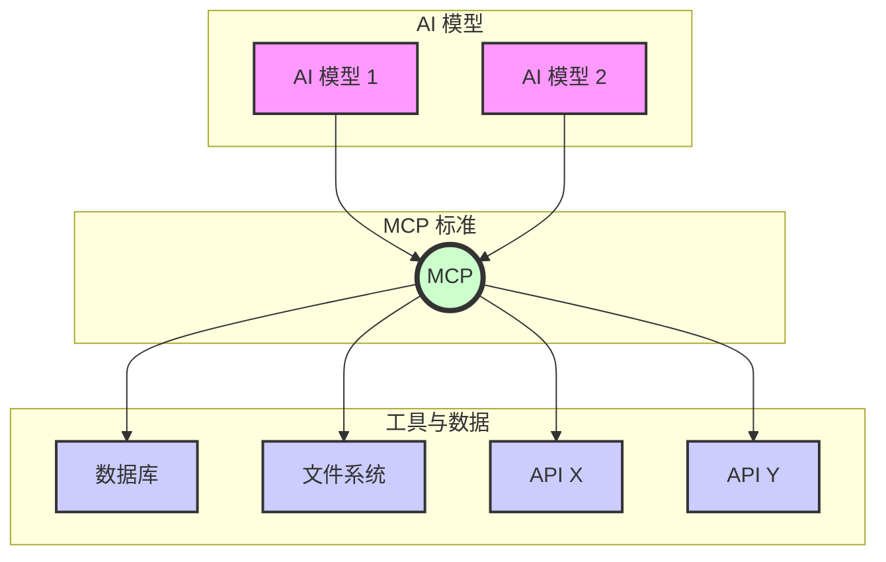

---
# 保持主题简洁
theme: default
# 随机高品质背景图
background: https://source.unsplash.com/collection/94734566/1920x1080
# 演示文稿标题和信息
title: MCP - AI 的通用连接器
info: |
  ## MCP：AI 的通用连接器

  模型上下文协议 (MCP) 简介及其为何备受关注。
# 用于居中的基本类
class: text-center
# 过渡效果
transition: slide-left
# 启用 MDC 语法
mdc: true
# 自定义字体和颜色
themeConfig:
  primary: '#4F46E5'
---

# MCP：AI 的通用连接器

  

    理解模型上下文协议 (MCP) 为何引人注目
  

  
  

    
MCP

  

  

  
你的名字/公司

---
layout: center
class: text-center
---

# 你是否曾经希望你的 AI 能够...

*   

 ...查找 实时 信息（而不仅仅是旧的训练数据）？

*   

 ...访问你 特定 的文档或代码？

*   

 ...连接到 你公司 的数据库？

*   

 ...代表你使用 其他 软件工具？

  

    <logos-anthropic class="text-6xl shadow-lg rounded-xl p-2 bg-white/10 backdrop-blur-sm" />
  

  

  

    <logos-visual-studio-code class="text-6xl shadow-lg rounded-xl p-2 bg-white/10 backdrop-blur-sm" />
  

  

  

    <logos-github-icon class="text-6xl shadow-lg rounded-xl p-2 bg-white/10 backdrop-blur-sm" />
  

  

  

    <logos-postgresql class="text-6xl shadow-lg rounded-xl p-2 bg-white/10 backdrop-blur-sm" />
  

  

  

    

  

...以及更多！

  

  

    这就是 MCP 发挥作用的地方！
  

---

# MCP 是什么？ 模型上下文协议

可以把它想象成 AI 的 USB-C 接口

  

    

      

MCP 之前
    

    

      每个 AI 和每个工具都需要混乱的自定义连接。
        
      (想象一下每个设备都需要不同的充电器！)
    

    
M 个模型 x N 个工具 = M*N 个连接

  

  

    

      

使用 MCP
    

    

      一个 标准协议 允许任何兼容的 AI 连接到任何兼容的工具。
        
      (一个标准端口搞定一切！)
    

    
M 个模型 + N 个工具 = M+N 个连接

  

---
layout: image-right
image: https://images.unsplash.com/photo-1516192518150-0d8fee5425e3?q=80&w=1000&auto=format&fit=crop&ixlib=rb-4.0.3
class: "bg-gradient-to-br from-indigo-50 to-blue-50 dark:from-indigo-900/20 dark:to-blue-900/20"
---

# 为什么 MCP 突然无处不在？

  

    

      

    

    

      
由 Anthropic (Claude AI) 推出

      
2024 年 11 月

    

  

  

    

      

    

    

      
快速普及

      
主要 AI 参与者 (OpenAI, Google, Microsoft) 和开发者工具 (VS Code, Cursor, Zed, Cloudflare, GitHub...) 迅速加入

    

  

  

    

      

    

    

      
解决了实际问题

      
通过将 AI 连接到现实世界和特定上下文，使其更加有用

    

  

  

    

      

    

    

      
开放标准

      
任何人都可以构建使用它的工具 (MCP 服务器) 或应用程序 (MCP 客户端)

    

  

  

  

    它正在快速构建一个生态系统！
  

---

# 哪些工具支持 MCP？客户端

  

    

      

      

        

          <logos-visual-studio-code class="text-5xl"/>
        

        
VS Code

        
(官方支持)

      

    

    
    

      

      

        

          <logos-cursor class="text-5xl"/>
        

        
Cursor

      

    

    
    

      

      

        

          <logos-anthropic-icon class="text-5xl"/>
        

        
Claude Desktop

      

    

    
    

      

      

        

          <logos-zed class="text-5xl"/>
        

        
Zed Editor

      

    

    
    

      

      

        

          <logos-neovim class="text-5xl"/>
        

        
Neovim

        
(通过插件)

      

    

    
    

      

      

        

          <logos-webstorm class="text-5xl"/>
        

        
JetBrains IDEs

        
(即将支持)

      

    

    
    

      

      

        

          <simple-icons-openai class="text-5xl"/>
        

        
OpenAI Agents SDK

      

    

    
    

      

      

        

          

        

        
Google

        
(Genkit 等)

      

    

    
    

      

      

        

          

        

        
更多工具加入中...

      

    

  

  具体支持程度（工具、资源、提示）可能因客户端而异

---
layout: two-cols
class: "bg-gradient-to-r from-amber-50 to-orange-50 dark:from-amber-900/20 dark:to-orange-900/20"
---

# 面临哪些挑战？

MCP 功能强大，但仍处于早期阶段

  

    

      

      安全性
      
最大挑战

    

    

      

        

        
如何确保服务器不会访问不该访问的内容？

      

      
例：一个设计用来查天气的 MCP 服务器，是否可能被用来读取你的本地文件？

      

        

        
特别是对于在你机器上运行的本地服务器，权限控制很重要。

      

      
例：AI 助手通过本地文件系统 MCP 读取了你的 SSH 私钥并泄露？

    

  

  

    

      

      成熟度
    

    

      该标准仍在不断发展，可能会有变化。早期采用者需要适应这些变化和迭代。
    

  

::right::

  

    

      

      发现机制
    

    

      如何找到并信任可靠、安全的 MCP 服务器？目前缺乏一个集中的可信任的工具目录。
    

  

  

    

      

      复杂性
    

    

      构建健壮且安全的服务器需要专业知识和谨慎。需要注意边界情况和错误处理。
    

  

  

    

      行业正在努力寻找解决方案，但需要
      保持谨慎，
      尤其是在安全方面。
    

  

---

# AI 能做什么？1/2 开发者篇

为开发者解锁超能力！

  

    

      

      代码理解与生成
    

    

      

        

        
"解释一下这个复杂的 <code>legacy_function</code> 函数是做什么的？" (AI 通过 MCP 读取本地代码)

      

      

        

        
"根据 <code>api_spec.json</code> 文件，为这个 API 端点生成 Python 客户端代码。"

      

    

  

  
  

    

      

      版本控制 (Git/GitHub)
    

    

      

        

        
"我本地 <code>main</code> 分支比远程落后多少个提交？" (AI 通过 MCP 查询 Git)

      

      

        

        
"为我当前的工作创建一个 Pull Request，标题是'修复登录 Bug'。" (AI 通过 MCP 与 GitHub 交互)

      

    

  

  
  

    

      

      数据库交互
    

    

      

        

        
"查询 <code>users</code> 表中过去 7 天注册的用户数量。" (AI 通过 MCP 查询数据库)

      

      

        

        
"在 <code>products</code> 表中查找所有价格低于 50 美元的商品。"

      

    

  

  
  

    

      

      云服务与部署
    

    

      

        

        
"检查 Cloudflare 上 <code>my-website.com</code> 的 DNS 记录。"

      

      

        

        
"列出 Heroku 上 'staging-app' 应用的最新部署日志。"

      

    

  

---

# AI 能做什么？2/2 企业与生产力篇

提升工作效率，连接业务系统！

  

    

      

      客户支持 & CRM
    

    

      

        

        
"查找客户 ID 为 C12345 的最新支持工单记录。" (AI 通过 MCP 连接 Zendesk/Salesforce)

      

      

        

        
"这位 VIP 客户的历史订单总额是多少？"

      

    

  

  
  

    

      

      企业知识库 & 文档
    

    

      

        

        
"我们公司的报销政策是什么？请在内部 Confluence 页面查找。" (AI 通过 MCP 搜索内部文档)

      

      

        

        
"总结一下上周 <code>Project Phoenix</code> 项目的会议纪要。"

      

    

  

  
  

    

      

      日常办公 & 协作
    

    

      

        

        
"帮我预定明天下午 2 点和张三的会议室。" (AI 通过 MCP 连接 Google Calendar/Outlook)

      

      

        

        
"在 Trello/Jira 上创建一个新任务，内容是'准备下周演示文稿'，截止日期是周五。"

      

    

  

  
  

    

      

      自动化工作流
    

    

      

        

        
"如果收到标记为'紧急'的邮件，自动在 Slack #urgent 频道提醒我。" (结合邮件和 Slack 的 MCP 服务器)

      

      

        

        
"当有新 Issue 分配给我时，自动在我的待办事项清单中创建任务。"

      

    

  

---
layout: center
class: "bg-gradient-to-br from-blue-50 to-indigo-50 dark:from-blue-900/20 dark:to-indigo-900/20"
---

# 在哪里可以找到 MCP 服务器？

  

    

      

        

          

            

          

          
官方 MCP 网站/文档

        

        

          <a href="https://modelcontextprotocol.io/" target="_blank" class="text-blue-600 dark:text-blue-400 underline">modelcontextprotocol.io</a> 通常会列出一些核心或示例服务器
        

      

      
      

        

          

            

          

          
社区维护的列表

        

        

          
Awesome Lists (在 GitHub 上搜索 "awesome-mcp")

          
类似 Zapier 等平台可能维护的集成列表

        

      

    

  

  
  

    

      

        

          

            

          

          
供应商/工具市场

        

        

          
一些公司 (如 GitHub, Sentry, Cloudflare) 提供官方的 MCP 服务器

          
像 Docker Hub 这样的平台也开始收录 MCP 服务器镜像

        

      

      
      

        

          

            

          

          
开源项目

        

        

          许多开发者在 GitHub 等平台开源了他们自己构建的 MCP 服务器
        

      

    

  

  

    

    

      
重要提示：

      
在使用非官方或社区提供的 MCP 服务器时，务必仔细评估其来源、可信度和安全性！优先选择官方或广泛使用的服务器，并检查其权限请求。

    

  

---
layout: center
class: "bg-gradient-to-br from-indigo-50 to-purple-50 dark:from-indigo-900/20 dark:to-purple-900/20"
---

# 关键要点

  

    

      

        

      

    

    

      
标准化协议

      
类似 USB-C，用于将 AI 连接到外部工具和数据

    

  

  
  

    

      

        

      

    

    

      
能力更强

      
使 AI 具备更强的上下文感知能力

    

  

  
  

    

      

        

      

    

    

      
迅速普及

      
在 AI 和开发者工具行业中快速采用

    

  

  
  

    

      

        

      

    

    

      
打破信息孤岛

      
实现激动人心的用例

    

  

  
  

    

      

        

      

    

    

      
安全性

      
随着生态系统的发展，是一个主要考虑因素

    

  

  
  

    

      

        

        

          MCP 是下一代 AI 应用的基础
        

      

    

  

---
layout: cover
background: https://images.unsplash.com/photo-1451187580459-43490279c0fa?q=80&w=1000&auto=format&fit=crop
class: "text-center"
---

# 谢谢！

  

    

      

      提问环节
    

  

  

  演示文稿使用 <a href="https://sli.dev" target="_blank" class="text-white/90 hover:text-white">Slidev</a> 构建

