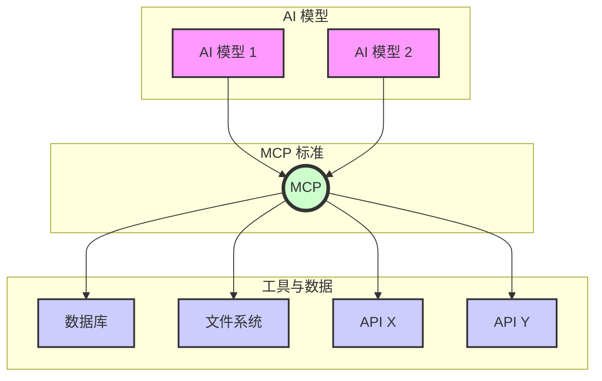

---
# 保持主题简洁
theme: default
# 移除随机背景图，使用简洁背景
# background: https://source.unsplash.com/collection/94734566/1920x1080
# 演示文稿标题和信息
title: MCP - AI 的通用连接器
info: |
  ## MCP：AI 的通用连接器

  模型上下文协议 (MCP) 简介及其为何备受关注。
# 用于居中的基本类
class: text-center
# 过渡效果
transition: slide-left
# 启用 MDC 语法
mdc: true
# 自定义字体和颜色 - 使用更中性的主色调
themeConfig:
  primary: '#0A84FF' # Apple Blue
---

# MCP：AI 的通用连接器

<div class="flex flex-col items-center justify-center h-full pt-10">
  <!-- 更简洁的副标题 -->
  <div class="text-xl text-gray-600 dark:text-gray-400 mb-6 animate-fade-in">
    理解模型上下文协议 (MCP) 为何引人注目
  </div>
</div>

---
layout: center
class: text-center
---

# 你是否曾经希望你的 AI 能够...

<div class="mt-10 flex flex-col items-center justify-center">
  <ul class="space-y-5 text-left max-w-2xl text-xl list-disc list-inside">
    <li v-click>查找 <span class="font-semibold text-blue-700 dark:text-blue-300 px-1.5 py-0.5 rounded bg-blue-100 dark:bg-blue-900/50">实时</span> 信息（而不仅仅是旧的训练数据）？</li>
    <li v-click>访问你 <span class="font-semibold text-blue-700 dark:text-blue-300 px-1.5 py-0.5 rounded bg-blue-100 dark:bg-blue-900/50">特定</span> 的文档或代码？</li>
    <li v-click>连接到 <span class="font-semibold text-green-700 dark:text-green-300 px-1.5 py-0.5 rounded bg-green-100 dark:bg-green-900/50">你公司</span> 的数据库？</li>
    <li v-click>代表你使用 <span class="font-semibold text-purple-700 dark:text-purple-300 px-1.5 py-0.5 rounded bg-purple-100 dark:bg-purple-900/50">其他</span> 软件工具？</li>
  </ul>
</div>

---
layout: center
class: text-center
---

<!-- 优化：Apple 风格强调 -->
<div 
  v-click 
  class="
    p-6
    rounded-lg
    inline-block 
  "
>
  <div class="flex items-center justify-center gap-3">
    <div class="i-carbon-plug text-4xl text-blue-500 dark:text-blue-400"></div>
    <div class="text-3xl font-semibold text-gray-900 dark:text-gray-50"> 
      这就是 MCP 发挥作用的地方！
    </div>
  </div>
</div>

---
layout: center
# 使用更中性的背景
class: "bg-gray-50 dark:bg-gray-900 text-center"
---

# MCP 是什么？<span class="text-transparent bg-clip-text bg-gradient-to-r from-blue-500 to-cyan-500"> 模型上下文协议</span>

<!-- 添加简短核心定义 -->
<div v-click class="mt-6 text-xl text-gray-800 dark:text-gray-200">
  一个用于连接 AI 模型与外部工具和数据的<span class="font-semibold text-blue-600 dark:text-blue-400">标准接口</span>。
</div>

<!-- 优化类比展示 -->
<div v-click class="mt-8 text-lg text-gray-600 dark:text-gray-400">
  简单来说，你可以把它想象成：
</div>

<div v-click class="mt-4 inline-flex items-center gap-2 px-4 py-2 bg-gradient-to-r from-gray-100 to-gray-200 dark:from-gray-700 dark:to-gray-800 rounded-lg shadow-md border border-gray-300 dark:border-gray-600">
  <div class="i-carbon-usb text-2xl text-blue-500"></div>
  <span class="font-mono text-lg font-medium text-gray-900 dark:text-gray-50">AI 的 USB-C 接口</span>
</div>

<!-- 优化过渡句 -->
<div v-click class="mt-12 text-gray-500 dark:text-gray-400 animate-fade-in animate-delay-500">
  为了理解它的重要性，让我们看看 MCP 出现前后的对比...
</div>

---
layout: center
# 使用更中性的背景
class: "bg-gray-50 dark:bg-gray-900" 
---

# MCP 之前：混乱的连接

<div class="flex flex-col items-center justify-center gap-6 mt-6">

  <!-- 1. 现象总结 -->
  <div class="p-4 rounded-lg bg-red-50 dark:bg-red-900/30 border border-red-200 dark:border-red-800/50 max-w-xl text-center text-base text-red-700 dark:text-red-300 font-semibold" v-click>
    每个 AI 和每个工具都需要各自定制的连接，极其混乱。
  </div>

  <!-- 2. 图示 -->
  <div class="w-full max-w-2xl" v-click>
    ```mermaid {scale: 0.8, theme: 'neutral'}
    graph TD
        subgraph AI 模型
            A[AI 模型 1]
            B[AI 模型 2]
        end
        subgraph 工具与数据
            T1[数据库]
            T2[文件系统]
            T3[API X]
            T4[API Y]
        end
        A --> T1
        A --> T2
        A --> T3
        A --> T4
        B --> T1
        B --> T2
        B --> T3
        B --> T4
        style A fill:#f9f,stroke:#333,stroke-width:2px
        style B fill:#f9f,stroke:#333,stroke-width:2px
        style T1 fill:#ccf,stroke:#333,stroke-width:2px
        style T2 fill:#ccf,stroke:#333,stroke-width:2px
        style T3 fill:#ccf,stroke:#333,stroke-width:2px
        style T4 fill:#ccf,stroke:#333,stroke-width:2px
    ```
  </div>

  <!-- 3. 问题点 -->
  <ul class="mt-4 space-y-2 text-left max-w-xl text-red-600 dark:text-red-400 text-base list-disc list-inside" v-click>
    <li>每增加一个模型或工具，连接数急剧增加</li>
    <li>维护成本高，易出错</li>
    <li>缺乏标准，难以扩展</li>
  </ul>

  <!-- 4. 公式单独突出 -->
  <div class="mt-4 px-4 py-2 rounded-lg bg-red-100 dark:bg-red-900/50 border border-red-300 dark:border-red-700 text-red-700 dark:text-red-300 font-mono text-lg font-bold" v-click>
    M 个模型 × N 个工具 = <span class="text-xl">M × N</span> 个连接
  </div>
</div>

---
layout: center
# 使用更中性的背景
class: "bg-gray-50 dark:bg-gray-900" 
---

# 使用 MCP：统一的标准

<!-- 使用更柔和的成功框样式 -->
<div class="mt-6 p-6 rounded-xl bg-green-50 dark:bg-green-900/30 border border-green-200 dark:border-green-800/50 max-w-2xl mx-auto shadow-sm">
  <div class="font-semibold text-lg text-green-700 dark:text-green-300 mb-3 flex items-center justify-center">
    <div class="i-carbon-checkmark-outline text-xl mr-2"></div>使用 MCP
  </div>
  <div class="text-green-600 dark:text-green-400 text-center mb-5 text-base leading-relaxed">
    一个 <span class="font-semibold">标准协议</span> 允许任何兼容的 AI 连接到任何兼容的工具。
    <br/>
    <span class="italic text-sm opacity-80">(一个标准端口搞定一切！)</span>
  </div>



<div class="text-center text-lg text-green-600 dark:text-green-300 mt-6 font-mono font-bold">
  M 个模型 + N 个工具 = M+N 个连接
</div>
</div>

---

# 关键前提：模型需支持 MCP

<div class="text-xl mb-8 text-gray-700 dark:text-gray-300 font-medium">MCP 只是"桥梁"，模型是"大脑"</div>

<!-- 使用标准卡片布局 -->
<div class="mt-8 max-w-3xl mx-auto space-y-5 text-left">
  <div class="flex items-start p-5 rounded-lg bg-white dark:bg-gray-800 shadow-sm border border-gray-200 dark:border-gray-700">
    <div class="i-carbon-brain text-3xl text-blue-500 dark:text-blue-400 mr-4 mt-1 flex-shrink-0"></div>
    <div>
      <div class="font-semibold text-gray-800 dark:text-gray-200 mb-1">AI 模型是核心</div>
      <div class="text-gray-600 dark:text-gray-400 text-sm leading-relaxed">仅仅有 MCP 服务器是不够的。AI 模型本身必须具备理解和使用外部工具的能力（通常称为 Tool Use 或 Function Calling）。</div>
    </div>
  </div>

  <div class="flex items-start p-5 rounded-lg bg-white dark:bg-gray-800 shadow-sm border border-gray-200 dark:border-gray-700">
    <div class="i-carbon-connect-target text-3xl text-blue-500 dark:text-blue-400 mr-4 mt-1 flex-shrink-0"></div>
    <div>
      <div class="font-semibold text-gray-800 dark:text-gray-200 mb-1">需要协议实现</div>
      <div class="text-gray-600 dark:text-gray-400 text-sm leading-relaxed">模型（或其代理/框架）需要实现 MCP 协议，才能与 MCP 服务器进行通信和交互。</div>
    </div>
  </div>
  
  <div class="flex items-start p-5 rounded-lg bg-white dark:bg-gray-800 shadow-sm border border-gray-200 dark:border-gray-700">
    <div class="i-carbon-machine-learning-model text-3xl text-blue-500 dark:text-blue-400 mr-4 mt-1 flex-shrink-0"></div>
    <div>
      <div class="font-semibold text-gray-800 dark:text-gray-200 mb-1">支持情况各异</div>
      <div class="text-gray-600 dark:text-gray-400 text-sm leading-relaxed">不同模型对工具使用的支持程度不同。一些新模型原生支持，一些则需要通过特定的框架（如 LangChain, Genkit）或客户端集成（如 VS Code 的 Copilot）来实现。</div>
    </div>
  </div>
</div>

<div class="mt-10 text-center text-sm text-gray-500 dark:text-gray-400">
  所以，选择 AI 工具时，也要看其背后的模型是否支持你需要的 MCP 功能。
</div>

---

# 哪些工具支持 MCP？<span class="text-sm opacity-70 ml-2">客户端 - Featured</span>

<!-- 统一卡片样式和布局，仅两组 -->
<div class="mt-8 grid grid-cols-1 md:grid-cols-2 gap-6 text-sm">

  <!-- Code Editors & IDEs -->
  <div v-click="1" class="space-y-4">
    <h3 class="text-lg font-semibold text-gray-700 dark:text-gray-300 mb-3 border-b border-gray-200 dark:border-gray-700 pb-2 flex items-center">
      <div class="i-carbon-code mr-2"></div> 编辑器 / IDE
    </h3>
    <div class="flex items-center gap-3 p-3 bg-gray-100 dark:bg-gray-800/80 rounded-lg shadow-sm border border-gray-200 dark:border-gray-700">
      
      <div class="text-gray-700 dark:text-gray-300"><span class="font-medium text-gray-800 dark:text-gray-200">Windsurf:</span> Purpose-built IDE</div>
    </div>
    <div class="flex items-center gap-3 p-3 bg-gray-100 dark:bg-gray-800/80 rounded-lg shadow-sm border border-gray-200 dark:border-gray-700">
      
      <div class="text-gray-700 dark:text-gray-300"><span class="font-medium text-gray-800 dark:text-gray-200">Cursor:</span> The AI Code Editor</div>
    </div>
    <div class="flex items-center gap-3 p-3 bg-gray-100 dark:bg-gray-800/80 rounded-lg shadow-sm border border-gray-200 dark:border-gray-700">
      <logos-visual-studio-code class="text-2xl flex-shrink-0"/>
      <div class="text-gray-700 dark:text-gray-300"><span class="font-medium text-gray-800 dark:text-gray-200">VS Code (OSS):</span> Official Support</div>
    </div>
     <div class="flex items-center gap-3 p-3 bg-gray-100 dark:bg-gray-800/80 rounded-lg shadow-sm border border-gray-200 dark:border-gray-700">
      <span class="text-2xl font-bold flex-shrink-0 w-6 text-center text-gray-600 dark:text-gray-400">C</span>
      <div class="text-gray-700 dark:text-gray-300"><span class="font-medium text-gray-800 dark:text-gray-200">Cline:</span> Autonomous Coding Agent</div>
    </div>
    <div class="flex items-center gap-3 p-3 bg-gray-100 dark:bg-gray-800/80 rounded-lg shadow-sm border border-gray-200 dark:border-gray-700">
       <span class="text-2xl font-bold flex-shrink-0 w-6 text-center text-gray-600 dark:text-gray-400">Z</span>
      <div class="text-gray-700 dark:text-gray-300"><span class="font-medium text-gray-800 dark:text-gray-200">Zed:</span> High-performance Editor</div>
    </div>
  </div>

  <!-- Chat Clients & Assistants -->
  <div v-click="2" class="space-y-4">
    <h3 class="text-lg font-semibold text-gray-700 dark:text-gray-300 mb-3 border-b border-gray-200 dark:border-gray-700 pb-2 flex items-center">
      <div class="i-carbon-chat mr-2"></div> 聊天客户端 / 助手
    </h3>
    <div class="flex items-center gap-3 p-3 bg-gray-100 dark:bg-gray-800/80 rounded-lg shadow-sm border border-gray-200 dark:border-gray-700">
      
      <div class="text-gray-700 dark:text-gray-300"><span class="font-medium text-gray-800 dark:text-gray-200">ChatWise:</span> AI chatbot</div>
    </div>
    <div class="flex items-center gap-3 p-3 bg-gray-100 dark:bg-gray-800/80 rounded-lg shadow-sm border border-gray-200 dark:border-gray-700">
       <span class="text-2xl flex-shrink-0 w-6 text-center">🍒</span>
      <div class="text-gray-700 dark:text-gray-300"><span class="font-medium text-gray-800 dark:text-gray-200">Cherry Studio:</span> Open Source Desktop</div>
    </div>
  </div>
</div>

<!-- 更简洁的来源链接 -->
<div v-click="4" class="mt-8 text-center text-xs text-gray-500 dark:text-gray-400">
  Source: <a href="https://mcp.so/clients?tag=featured" target="_blank" class="text-blue-600 dark:text-blue-400 hover:underline">mcp.so Featured Clients</a> (List may change)
</div>

---
layout: two-cols
# 使用更中性的背景
class: "bg-gray-50 dark:bg-gray-900"
---

# 面临哪些挑战？ <span class="ml-2 px-2 py-1 bg-red-100 text-red-700 rounded text-base align-middle">问题</span>

<div class="space-y-6 pr-6">
  <div class="flex items-start gap-4 p-5 rounded-lg bg-red-50 dark:bg-red-900/30 border border-red-200 dark:border-red-700 shadow-sm">
    <div class="i-carbon-warning-alt text-3xl text-red-500 flex-shrink-0"></div>
    <div>
      <div class="font-semibold text-lg text-red-700 dark:text-red-400 mb-1">安全性 <span class="ml-2 px-2 py-0.5 text-xs bg-red-200 text-red-800 rounded-full font-medium">最大挑战</span></div>
      <div class="text-gray-700 dark:text-gray-300 text-sm leading-relaxed">
        如何确保服务器不会访问不该访问的内容？<br>
        <span class="text-xs text-gray-500 dark:text-gray-400 italic">例：天气查询工具被用来读取本地文件？</span>
      </div>
    </div>
  </div>
  <div class="flex items-start gap-4 p-5 rounded-lg bg-orange-50 dark:bg-orange-900/30 border border-orange-200 dark:border-orange-700 shadow-sm">
    <div class="i-carbon-hourglass text-3xl text-orange-500 flex-shrink-0"></div>
    <div>
      <div class="font-semibold text-lg text-orange-700 dark:text-orange-400 mb-1">成熟度</div>
      <div class="text-gray-700 dark:text-gray-300 text-sm leading-relaxed">
        标准仍在发展，早期采用者需适应变化和迭代。
      </div>
    </div>
  </div>
  <div class="flex items-start gap-4 p-5 rounded-lg bg-yellow-50 dark:bg-yellow-900/30 border border-yellow-200 dark:border-yellow-700 shadow-sm">
    <div class="i-carbon-user-certification text-3xl text-yellow-500 flex-shrink-0"></div>
    <div>
      <div class="font-semibold text-lg text-yellow-700 dark:text-yellow-400 mb-1">上手的门槛</div>
      <div class="text-gray-700 dark:text-gray-300 text-sm leading-relaxed">
        对开发者和用户来说，理解和配置 MCP 生态的各类组件、权限和协议细节有一定难度。需要更好的文档和引导。
      </div>
    </div>
  </div>
</div>

::right::

<div class="flex flex-col items-center justify-center h-full gap-6">
  <div class="i-carbon-roadblock text-7xl text-red-300 dark:text-red-700 opacity-70"></div>
  <div class="i-carbon-warning-filled text-5xl text-orange-400 dark:text-orange-300 opacity-80"></div>
  <div class="text-red-600 dark:text-red-400 text-lg font-bold mt-4">这些挑战阻碍了 MCP 的大规模落地</div>
</div>

---
layout: default
# 使用更中性的背景
class: "bg-gray-50 dark:bg-gray-900"
---

# 面临哪些挑战？ (2/2)

<!-- 使用标准卡片布局 -->
<div class="grid grid-cols-1 md:grid-cols-2 gap-6 mt-8">
  <div v-click="1" class="p-5 rounded-lg bg-white dark:bg-gray-800 shadow-sm border border-gray-200 dark:border-gray-700">
    <div class="text-lg font-semibold text-gray-800 dark:text-gray-200 mb-2 flex items-center">
      <div class="i-carbon-map text-2xl mr-2 text-blue-500 dark:text-blue-400"></div>
      发现机制
    </div>
    <div class="text-gray-600 dark:text-gray-400 text-sm leading-relaxed">
      如何找到并信任可靠、安全的 MCP 服务器？目前缺乏一个集中的可信任的工具目录。
    </div>
  </div>

  <div v-click="2" class="p-5 rounded-lg bg-white dark:bg-gray-800 shadow-sm border border-gray-200 dark:border-gray-700">
    <div class="text-lg font-semibold text-gray-800 dark:text-gray-200 mb-2 flex items-center">
      <div class="i-carbon-terminal text-2xl mr-2 text-blue-500 dark:text-blue-400"></div>
      复杂性
    </div>
    <div class="text-gray-600 dark:text-gray-400 text-sm leading-relaxed">
      构建健壮且安全的服务器需要专业知识和谨慎。需要注意边界情况和错误处理。
    </div>
  </div>

  <!-- 新增：上手门槛的解决办法 -->
  <div v-click="3" class="p-5 rounded-lg bg-white dark:bg-gray-800 shadow-sm border border-yellow-200 dark:border-yellow-700">
    <div class="text-lg font-semibold text-yellow-700 dark:text-yellow-400 mb-2 flex items-center">
      <div class="i-carbon-user-certification text-2xl mr-2 text-yellow-500"></div>
      降低上手门槛
    </div>
    <div class="text-gray-700 dark:text-gray-300 text-sm leading-relaxed">
      官方和社区正在推出 <span class="font-semibold">一键部署</span> 方案、<span class="font-semibold">可视化配置工具</span>，并持续完善 <span class="font-semibold">详细的入门文档</span> 和 <span class="font-semibold">视频教程</span>，帮助开发者和用户快速上手 MCP 生态。
    </div>
  </div>
</div>

<!-- 调整强调框样式 -->
<div v-click="4" class="p-6 mt-12 rounded-lg bg-orange-50 dark:bg-orange-900/30 border border-orange-200 dark:border-orange-800/50 shadow-sm max-w-3xl mx-auto">
  <div class="text-center text-base font-medium text-orange-700 dark:text-orange-300 leading-relaxed">
    行业正在努力寻找解决方案，但需要
    <span class="font-semibold text-red-600 dark:text-red-400">保持谨慎</span>，
    尤其是在安全方面。
  </div>
</div>

---

# AI 能做什么？<span class="text-sm opacity-70 ml-2">1/2 开发者篇</span>

<div class="text-xl mb-6 text-gray-700 dark:text-gray-300 font-medium">为开发者解锁超能力！</div>

<!-- 使用标准卡片布局 -->
<div class="grid grid-cols-1 md:grid-cols-2 gap-6">
  <div v-click="1" class="p-5 rounded-lg bg-white dark:bg-gray-800 border border-gray-200 dark:border-gray-700 shadow-sm hover:shadow-md transition-shadow">
    <div class="text-lg font-semibold text-gray-800 dark:text-gray-200 mb-3 flex items-center">
      <div class="i-logos-github-icon text-xl mr-1"></div> / <div class="i-simple-icons-gitee text-xl ml-1 mr-2 text-[#C71D23]"></div>
      版本控制
    </div>
    <div class="space-y-3 text-sm text-gray-600 dark:text-gray-400 leading-relaxed ml-1">
      <div class="flex items-start gap-2">
        <div class="i-carbon-chevron-right text-blue-500 flex-shrink-0 mt-1"></div>
        <div>"我本地 <code>main</code> 分支比 Gitee 远程落后多少个提交？" <span class="text-xs text-gray-400 dark:text-gray-500 italic block mt-1">(AI 通过 MCP 查询 Git/Gitee)</span></div>
      </div>
      <div class="flex items-start gap-2">
        <div class="i-carbon-chevron-right text-blue-500 flex-shrink-0 mt-1"></div>
        <div>"为我当前的工作在 GitHub 创建一个 Pull Request，标题是'修复登录 Bug'。" <span class="text-xs text-gray-400 dark:text-gray-500 italic block mt-1">(AI 通过 MCP 与 GitHub 交互)</span></div>
      </div>
    </div>
  </div>
  
  <div v-click="2" class="p-5 rounded-lg bg-white dark:bg-gray-800 border border-gray-200 dark:border-gray-700 shadow-sm hover:shadow-md transition-shadow">
    <div class="text-lg font-semibold text-gray-800 dark:text-gray-200 mb-3 flex items-center">
      <div class="i-carbon-database text-2xl mr-2 text-blue-500"></div>
      数据库交互
    </div>
    <div class="space-y-3 text-sm text-gray-600 dark:text-gray-400 leading-relaxed ml-1">
      <div class="flex items-start gap-2">
        <div class="i-carbon-chevron-right text-blue-500 flex-shrink-0 mt-1"></div>
        <div>"查询 <code>users</code> 表中过去 7 天注册的用户数量。" <span class="text-xs text-gray-400 dark:text-gray-500 italic block mt-1">(AI 通过 MCP 查询数据库)</span></div>
      </div>
      <div class="flex items-start gap-2">
        <div class="i-carbon-chevron-right text-blue-500 flex-shrink-0 mt-1"></div>
        <div>"在 <code>products</code> 表中查找所有价格低于 50 元的商品。"</div>
      </div>
    </div>
  </div>
  
  <div v-click="3" class="p-5 rounded-lg bg-white dark:bg-gray-800 border border-gray-200 dark:border-gray-700 shadow-sm hover:shadow-md transition-shadow">
    <div class="text-lg font-semibold text-gray-800 dark:text-gray-200 mb-3 flex items-center">
      <div class="i-carbon-cloud-services text-2xl mr-2 text-blue-500"></div>
      云服务与部署
    </div>
    <div class="space-y-3 text-sm text-gray-600 dark:text-gray-400 leading-relaxed ml-1">
      <div class="flex items-start gap-2">
        <div class="i-carbon-chevron-right text-blue-500 flex-shrink-0 mt-1"></div>
        <div>"检查阿里云上 <code>my-app</code> 函数计算服务的最新日志。" <span class="text-xs text-gray-400 dark:text-gray-500 italic block mt-1">(AI 通过 MCP 连接阿里云)</span></div>
      </div>
      <div class="flex items-start gap-2">
        <div class="i-carbon-chevron-right text-blue-500 flex-shrink-0 mt-1"></div>
        <div>"列出腾讯云上 'staging-server' 轻量应用服务器的监控数据。" <span class="text-xs text-gray-400 dark:text-gray-500 italic block mt-1">(AI 通过 MCP 连接腾讯云)</span></div>
      </div>
    </div>
  </div>
</div>

---

# AI 能做什么？<span class="text-sm opacity-70 ml-2">2/2 日常生活篇</span>

<div class="text-xl mb-6 text-gray-700 dark:text-gray-300 font-medium">让 AI 成为你的生活助手！</div>

<!-- 使用更紧凑的网格和标准卡片 -->
<div class="grid grid-cols-2 gap-5">
  <div v-click="1" class="p-5 rounded-lg bg-white dark:bg-gray-800 border border-gray-200 dark:border-gray-700 shadow-sm hover:shadow-md transition-shadow">
    <div class="text-lg font-semibold text-gray-800 dark:text-gray-200 mb-3 flex items-center">
      <div class="i-carbon-train text-2xl mr-2 text-blue-500"></div>
      出行与旅行
    </div>
    <div class="space-y-3 text-sm text-gray-600 dark:text-gray-400 leading-relaxed ml-1">
      <div class="flex items-start gap-2">
        <div class="i-carbon-chevron-right text-blue-500 flex-shrink-0 mt-1"></div>
        <div>"帮我查一下明天从上海到杭州的高铁票，下午出发。" <span class="text-xs text-gray-400 dark:text-gray-500 italic block mt-1">(AI 通过 MCP 连接 12306/携程)</span></div>
      </div>
      <div class="flex items-start gap-2">
        <div class="i-carbon-chevron-right text-blue-500 flex-shrink-0 mt-1"></div>
        <div>"查找西湖附近评分高、价格适中的酒店。" <span class="text-xs text-gray-400 dark:text-gray-500 italic block mt-1">(AI 通过 MCP 连接地图/酒店预订 App)</span></div>
      </div>
    </div>
  </div>
  
  <div v-click="2" class="p-5 rounded-lg bg-white dark:bg-gray-800 border border-gray-200 dark:border-gray-700 shadow-sm hover:shadow-md transition-shadow">
    <div class="text-lg font-semibold text-gray-800 dark:text-gray-200 mb-3 flex items-center">
      <div class="i-carbon-shopping-cart text-2xl mr-2 text-blue-500"></div>
      购物与娱乐
    </div>
    <div class="space-y-3 text-sm text-gray-600 dark:text-gray-400 leading-relaxed ml-1">
      <div class="flex items-start gap-2">
        <div class="i-carbon-chevron-right text-blue-500 flex-shrink-0 mt-1"></div>
        <div>"在淘宝/京东上找一款评价最好的无线蓝牙耳机，预算 500 元内。" <span class="text-xs text-gray-400 dark:text-gray-500 italic block mt-1">(AI 通过 MCP 连接电商平台)</span></div>
      </div>
      <div class="flex items-start gap-2">
        <div class="i-carbon-chevron-right text-blue-500 flex-shrink-0 mt-1"></div>
        <div>"根据我的喜好，在 Bilibili 上推荐一些有趣的科技类 UP 主。" <span class="text-xs text-gray-400 dark:text-gray-500 italic block mt-1">(AI 通过 MCP 连接视频平台)</span></div>
      </div>
    </div>
  </div>
  
  <div v-click="3" class="p-5 rounded-lg bg-white dark:bg-gray-800 border border-gray-200 dark:border-gray-700 shadow-sm hover:shadow-md transition-shadow">
    <div class="text-lg font-semibold text-gray-800 dark:text-gray-200 mb-3 flex items-center">
      <div class="i-carbon-book text-2xl mr-2 text-blue-500"></div>
      学习与信息获取
    </div>
    <div class="space-y-3 text-sm text-gray-600 dark:text-gray-400 leading-relaxed ml-1">
      <div class="flex items-start gap-2">
        <div class="i-carbon-chevron-right text-blue-500 flex-shrink-0 mt-1"></div>
        <div>"查找关于'人工智能伦理'的最新中文研究论文，并总结摘要。" <span class="text-xs text-gray-400 dark:text-gray-500 italic block mt-1">(AI 通过 MCP 连接学术搜索/网页)</span></div>
      </div>
      <div class="flex items-start gap-2">
        <div class="i-carbon-chevron-right text-blue-500 flex-shrink-0 mt-1"></div>
        <div>"帮我找一个简单的红烧肉菜谱，需要有视频教程。" <span class="text-xs text-gray-400 dark:text-gray-500 italic block mt-1">(AI 通过 MCP 连接下厨房/B站)</span></div>
      </div>
    </div>
  </div>
  
  <div v-click="4" class="p-5 rounded-lg bg-white dark:bg-gray-800 border border-gray-200 dark:border-gray-700 shadow-sm hover:shadow-md transition-shadow">
    <div class="text-lg font-semibold text-gray-800 dark:text-gray-200 mb-3 flex items-center">
      <div class="i-carbon-light text-2xl mr-2 text-blue-500"></div> <!-- Changed icon for better representation -->
      智能家居与其他
    </div>
    <div class="space-y-3 text-sm text-gray-600 dark:text-gray-400 leading-relaxed ml-1">
      <div class="flex items-start gap-2">
        <div class="i-carbon-chevron-right text-blue-500 flex-shrink-0 mt-1"></div>
        <div>"打开客厅的灯，并把空调调到 26 度。" <span class="text-xs text-gray-400 dark:text-gray-500 italic block mt-1">(AI 通过 MCP 连接米家/HomeKit)</span></div>
      </div>
      <div class="flex items-start gap-2">
        <div class="i-carbon-chevron-right text-blue-500 flex-shrink-0 mt-1"></div>
        <div>"提醒我晚上 8 点记得吃药。" <span class="text-xs text-gray-400 dark:text-gray-500 italic block mt-1">(AI 通过 MCP 设置提醒事项)</span></div>
      </div>
    </div>
  </div>
</div>

---
layout: center
# 使用更中性的背景
class: "bg-gray-50 dark:bg-gray-900"
---

# 简化连接，发现和管理 MCP 工具


<!-- 统一卡片样式和布局 -->
<div class="grid grid-cols-1 md:grid-cols-2 gap-6 max-w-4xl mx-auto">
  <div class="space-y-4">
    <div class="text-lg font-semibold text-gray-800 dark:text-gray-200 mb-3 text-center pb-2 border-b border-gray-200 dark:border-gray-700">🇨🇳 国内平台</div>
    <div v-click="1" class="p-4 rounded-lg bg-white dark:bg-gray-800 shadow-sm border border-gray-200 dark:border-gray-700 flex items-center gap-4">
      <div class="i-carbon-store text-3xl text-blue-500 flex-shrink-0"></div>
      <div>
        <div class="font-medium text-gray-800 dark:text-gray-200"><a href="https://mcp.appmall.com" target="_blank" class="text-blue-600 dark:text-blue-400 hover:underline">MCP AppMall</a></div>
        <div class="text-sm text-gray-500 dark:text-gray-400">提供 MCP 工具的应用市场</div>
      </div>
    </div>
    <div v-click="2" class="p-4 rounded-lg bg-white dark:bg-gray-800 shadow-sm border border-gray-200 dark:border-gray-700 flex items-center gap-4">
      <i-logos-alibaba-cloud class="text-3xl flex-shrink-0"/>
      <div>
        <div class="font-medium text-gray-800 dark:text-gray-200"><a href="https://bailian.console.aliyun.com/?tab=mcp#/mcp-market" target="_blank" class="text-blue-600 dark:text-blue-400 hover:underline">阿里云百炼 MCP 市场</a></div>
        <div class="text-sm text-gray-500 dark:text-gray-400">阿里云提供的 MCP 工具市场</div>
      </div>
    </div>
     <div v-click="3" class="p-4 rounded-lg bg-white dark:bg-gray-800 shadow-sm border border-gray-200 dark:border-gray-700 flex items-center gap-4">
      <i-logos-tencent-cloud class="text-3xl flex-shrink-0"/>
      <div>
        <div class="font-medium text-gray-800 dark:text-gray-200"><a href="https://tcb.cloud.tencent.com/mcp-server" target="_blank" class="text-blue-600 dark:text-blue-400 hover:underline">腾讯云 CloudBase MCP</a></div>
        <div class="text-sm text-gray-500 dark:text-gray-400">腾讯云提供的 MCP 服务器托管与集成</div>
      </div>
    </div>
  </div>

  <div class="space-y-4">
    <div class="text-lg font-semibold text-gray-800 dark:text-gray-200 mb-3 text-center pb-2 border-b border-gray-200 dark:border-gray-700">🌍 国际平台</div>
    <div v-click="4" class="p-4 rounded-lg bg-white dark:bg-gray-800 shadow-sm border border-gray-200 dark:border-gray-700 flex items-center gap-4">
      
      <div>
        <div class="font-medium text-gray-800 dark:text-gray-200"><a href="https://mcp.so/" target="_blank" class="text-blue-600 dark:text-blue-400 hover:underline font-bold">MCP.so</a></div>
        <div class="text-sm text-gray-500 dark:text-gray-400">官方协议网站，提供客户端/服务器列表</div>
      </div>
    </div>
    <div v-click="5" class="p-4 rounded-lg bg-white dark:bg-gray-800 shadow-sm border border-gray-200 dark:border-gray-700 flex items-center gap-4">
      <div class="i-carbon-magic-wand text-3xl text-blue-500 flex-shrink-0"></div> <!-- Changed icon -->
      <div>
        <div class="font-medium text-gray-800 dark:text-gray-200"><a href="https://glama.ai/" target="_blank" class="text-blue-600 dark:text-blue-400 hover:underline font-bold">Glama.ai</a></div>
        <div class="text-sm text-gray-500 dark:text-gray-400">构建和连接 AI 应用的平台</div>
      </div>
    </div>
    <div v-click="6" class="p-4 rounded-lg bg-white dark:bg-gray-800 shadow-sm border border-gray-200 dark:border-gray-700 flex items-center gap-4">
       <div class="i-carbon-tool-kit text-3xl text-blue-500 flex-shrink-0"></div>
      <div>
        <div class="font-medium text-gray-800 dark:text-gray-200"><a href="https://smithery.ai/" target="_blank" class="text-blue-600 dark:text-blue-400 hover:underline">Smithery.ai</a></div>
        <div class="text-sm text-gray-500 dark:text-gray-400">AI Agent 和工具构建平台</div>
      </div>
    </div>
  </div>
</div>

<!-- 调整注意框样式 -->
<div v-click="7" class="mt-10 p-4 mx-auto max-w-3xl rounded-lg bg-blue-50 dark:bg-blue-900/30 border-l-4 border-blue-400 dark:border-blue-600 shadow-sm">
  <div class="text-blue-800 dark:text-blue-200 text-sm leading-relaxed">
    <span class="font-semibold">注意：</span> 各平台收录的 MCP 工具数量可能随时变化，且具体支持情况各异。建议访问平台官网获取最新信息。
  </div>
</div>

---
layout: center
# 使用更中性的背景
class: "bg-gray-50 dark:bg-gray-900"
---

# 关键要点

<!-- 优化后的网格布局，分两行，每行3个卡片，最后强调句单独一行 -->
<div class="grid grid-cols-1 md:grid-cols-3 gap-5 mt-10">
  <div v-click="1" class="p-5 bg-white dark:bg-gray-800 rounded-xl shadow-md border border-gray-200 dark:border-gray-700 flex flex-col items-center h-full">
    <div class="w-12 h-12 rounded-full bg-blue-100 dark:bg-blue-900/50 flex items-center justify-center mb-3">
      <div class="i-carbon-link text-2xl text-blue-600 dark:text-blue-400"></div>
    </div>
    <div class="font-semibold text-gray-800 dark:text-gray-200 mb-1">标准化协议</div>
    <div class="text-gray-600 dark:text-gray-400 text-sm text-center">类似 USB-C，用于将 AI 连接到外部工具和数据</div>
  </div>
  <div v-click="2" class="p-5 bg-white dark:bg-gray-800 rounded-xl shadow-md border border-gray-200 dark:border-gray-700 flex flex-col items-center h-full">
    <div class="w-12 h-12 rounded-full bg-blue-100 dark:bg-blue-900/50 flex items-center justify-center mb-3">
      <div class="i-carbon-increase-level text-2xl text-blue-600 dark:text-blue-400"></div>
    </div>
    <div class="font-semibold text-gray-800 dark:text-gray-200 mb-1">能力更强</div>
    <div class="text-gray-600 dark:text-gray-400 text-sm text-center">使 AI 具备更强的上下文感知能力</div>
  </div>
  <div v-click="3" class="p-5 bg-white dark:bg-gray-800 rounded-xl shadow-md border border-gray-200 dark:border-gray-700 flex flex-col items-center h-full">
    <div class="w-12 h-12 rounded-full bg-blue-100 dark:bg-blue-900/50 flex items-center justify-center mb-3">
      <div class="i-carbon-rocket text-2xl text-blue-600 dark:text-blue-400"></div>
    </div>
    <div class="font-semibold text-gray-800 dark:text-gray-200 mb-1">迅速普及</div>
    <div class="text-gray-600 dark:text-gray-400 text-sm text-center">在 AI 和开发者工具行业中快速采用</div>
  </div>
  <div v-click="4" class="p-5 bg-white dark:bg-gray-800 rounded-xl shadow-md border border-gray-200 dark:border-gray-700 flex flex-col items-center h-full">
    <div class="w-12 h-12 rounded-full bg-blue-100 dark:bg-blue-900/50 flex items-center justify-center mb-3">
      <div class="i-carbon-network-4 text-2xl text-blue-600 dark:text-blue-400"></div>
    </div>
    <div class="font-semibold text-gray-800 dark:text-gray-200 mb-1">打破信息孤岛</div>
    <div class="text-gray-600 dark:text-gray-400 text-sm text-center">实现激动人心的用例</div>
  </div>
  <div v-click="5" class="p-5 bg-white dark:bg-gray-800 rounded-xl shadow-md border border-red-200 dark:border-red-800/50 flex flex-col items-center h-full">
    <div class="w-12 h-12 rounded-full bg-red-100 dark:bg-red-900/50 flex items-center justify-center mb-3">
      <div class="i-carbon-security text-2xl text-red-600 dark:text-red-400"></div>
    </div>
    <div class="font-semibold text-red-700 dark:text-red-300 mb-1">安全性</div>
    <div class="text-gray-600 dark:text-gray-400 text-sm text-center">随着生态系统的发展，是一个主要考虑因素</div>
  </div>
  <div v-click="6" class="p-5 bg-white dark:bg-gray-800 rounded-xl shadow-md border border-gray-200 dark:border-gray-700 flex flex-col items-center h-full">
    <div class="w-12 h-12 rounded-full bg-blue-100 dark:bg-blue-900/50 flex items-center justify-center mb-3">
      <div class="i-carbon-star text-2xl text-blue-600 dark:text-blue-400"></div>
    </div>
    <div class="font-semibold text-gray-800 dark:text-gray-200 mb-1">生态活跃</div>
    <div class="text-gray-600 dark:text-gray-400 text-sm text-center">开发者和平台积极参与</div>
  </div>
</div>


---

<div class="text-center w-full h-full">
    MCP 是下一代 AI 应用的基础 ?
</div>

---

---
layout: cover
class: "text-center bg-gray-100 dark:bg-gray-900"
---

# 谢谢！


