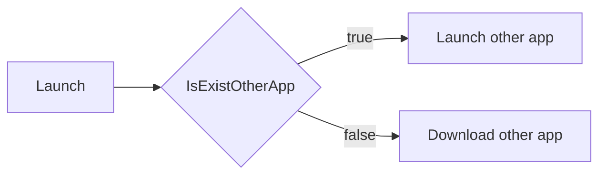

# Uniapp 应用跳转 


贺聂双 / <span text-3>旺工牌</span>   


---
class: text-center
layout: cover
transition: fade
---

# App Schema 


---
class: text-center
layout: cover
transition: fade
---

# app://hello?word=hi 


---
clicks: 4
---


<h1>
  Uniapp Config 
  <span text-4  v-click='1'>/ manifest.json</span> 
</h1>


<div v-click='2'>


```js {all|all|8-11|13-17|all}{lines:true}
{
  // ...
  "app-plus" : {
    // ...
    "distribute" : {

      // ...
      "android" : {
        // ...
        "schemes" : "mine",
      },

      "ios" : {
        // ...
        "urltypes" : "mine",
        "urlschemewhitelist" : "other"
      }

    }
  }
}
```

</div>


---
class: text-center
layout: cover
transition: fade
---


<div
  v-motion
  :initial="{ x: 0 }"
  :enter="{ x: 0 }"
  :click-1="{ x: -120 }"
  :leave="{ x: -120 }"
>
  <h1>Apply</h1>
</div>

<div v-click="1" absolute class="left-50% bottom-50%" bottom-20 text-8>Launch</div>
<div v-click="2" absolute class="left-50% bottom-40%" bottom-20 text-8>Receive</div>


---

# Launch


<div v-click="1" class="h-90 flex items-center justify-center">




</div>


---


<h1>
  Launch 
  <span text-4>/ apis</span> 
</h1>


<div h-90 flex items-center text-10>

<v-clicks>

- [plus.runtime.isApplicationExist](https://www.dcloud.io/docs/api/zh_cn/runtime.html#plus.runtime.isApplicationExist)


- [plus.runtime.launchApplication](https://www.dcloud.io/docs/api/zh_cn/runtime.html#plus.runtime.launchApplication)

</v-clicks>
</div>


---


<h1>
  Launch 
  <span text-4>/ code</span> 
</h1>


<div v-click="1">


```js
const createAppSchemaJumpFn = (params) => {
  const { pname, action, iosMarketUrl, androidMarketUrl } = params
  let isIos = false
  let isAndroid = false
  //  #ifdef APP-PLUS
  isIos = plus.os.name == 'iOS'
  isAndroid = plus.os.name == 'Android'
  //  #endif
  return ({ schema, extra }) => {
    const isExistOtherApp = plus.runtime.isApplicationExist(pname, action)
    if (!isExistOtherApp) {
      plus.runtime.openURL(isIos ? iosMarketUrl : androidMarketUrl)
      return
    }
    if (isAndroid) {
      plus.runtime.launchApplication({ pname, extra })
    }
    if (isIos) {
      plus.runtime.launchApplication({ action: schema })
    }
  }
}
```

</div>


<RiQuestionMark v-click="3" color-red absolute class="top-40% left-70% text-30" />


---


<h1>
  Launch 
  <span text-4>/ code question</span> 
</h1>


<div h-90 flex items-center text-8>

<v-clicks>

- plus.runtime.isApplicationExist  <span text-red text-12>Ios invalidate</span>

- plus.runtime.launchApplication   <span text-red text-12>Android invalidate</span>

</v-clicks>
</div>


---


<h1>
  Launch 
  <span v-if="$clicks === 0" text-4>/ before code</span> 
  <span v-if="$clicks === 1" text-4>/ after code</span> 
</h1>


````md magic-move
```js
const createAppSchemaJumpFn = (params) => {
  const { pname, action, iosMarketUrl, androidMarketUrl } = params
  let isIos = false
  let isAndroid = false
  //  #ifdef APP-PLUS
  isIos = plus.os.name == 'iOS'
  isAndroid = plus.os.name == 'Android'
  //  #endif
  return ({ schema, extra }) => {
    const isExistOtherApp = plus.runtime.isApplicationExist(pname, action)
    if (!isExistOtherApp) {
      plus.runtime.openURL(isIos ? iosMarketUrl : androidMarketUrl)
      return
    }
    if (isAndroid) {
      plus.runtime.launchApplication({ pname, extra })
    }
    if (isIos) {
      plus.runtime.launchApplication({ action: schema })
    }
  }
}

```
```js
const createAppSchemaJumpFn = (params) => {
  const { pname, action, iosMarketUrl, androidMarketUrl } = params
  let isIos = false
  let isAndroid = false
  //  #ifdef APP-PLUS
  isIos = plus.os.name == 'iOS'
  isAndroid = plus.os.name == 'Android'
  //  #endif
  return ({ schema }) => { // only schema
    if (isAndroid) {
      if (plus.runtime.isApplicationExist(pname, action)) {
        const mContext = plus.android.runtimeMainActivity()
        const Uri = plus.android.importClass('android.net.Uri')
        const Intent = plus.android.importClass('android.content.Intent') // native intent
        const intent = new Intent(Intent.ACTION_VIEW, Uri.parse(schema))
        mContext.startActivity(intent)
      } else {
        plus.runtime.openURL(androidMarketUrl)
      }
    }
    if (isIos) {
      plus.runtime.launchApplication({ action: schema }, function () {
        plus.runtime.openURL(iosMarketUrl) // fail callback
      })
    }
  }
}
```
````


---

<h1>
  Receive 
  <span v-click='1' text-4>/ app.vue </span> 
</h1>


<div class="flex justify-start">
  <div class="w-90 flex flex-col justify-center text-8">
    <div v-click="3">args 获取时机</div>
    <div v-click="5">args 清除</div>
  </div>


  <div class="flex-auto" v-click="2">


````md magic-move

```js

```

```js

```

```js
// ....

<script>
export default {
  name: 'App',
  // ...
  onShow() {
    const args = plus.runtime.arguments
    if (args) {
      // todo
    }
  }
  // ...
}
</script>
```


```js
// ....

<script>
export default {
  name: 'App',
  // ...
  onShow() {
    const args = plus.runtime.arguments
    if (args) {
      // todo
    }
  }
  // ...
}
</script>
```

```js
// ....

<script>
export default {
  name: 'App',
  // ...
  async onShow() {
    await sleep(0)
    const args = plus.runtime.arguments
    if (args) {
      // todo
    }
  }
  // ...
}
</script>
```

```js
// ....

<script>
export default {
  name: 'App',
  // ...
  async onShow() {
    await sleep(0)
    const args = plus.runtime.arguments
    if (args) {
      // todo
    }
  }
  // ...
}
</script>
```

```js
// ....

<script>
export default {
  name: 'App',
  // ...
  async onShow() {
    await sleep(0)
    const args = plus.runtime.arguments
    if (args) {
      // todo
    }
    plus.runtime.arguments = null
    plus.runtime.arguments = ''
  }
  // ...
}
</script>

```
````
  </div>
</div>


---

<h1>
  Receive 
  <span text-4 v-click="1" >/ pages.json</span> 
</h1>


<div v-click="2">


````md magic-move

```js

```


```js

```

```json
{
  // ...
  "uniIdRouter": {
    "condition": {
      "current": 0,
      "list": [
        {
          "name": "",
          "path": "",
          "query": ""
        }
      ]
    }
  }
}

```

```json
{
  // ...
  "uniIdRouter": {
    // #ifdef APP-ANDROID
    "condition": {
      "current": 0,
      "list": [
        {
          "name": "",
          "path": "",
          "query": ""
        }
      ]
    }
    // #endif
  }
}

```

````

</div>


---
class: text-center
layout: cover
---

# Conclusion 


---

# Conclusion 


<div h-90 flex items-center text-10 >

<v-clicks>

- Api 兼容性问题
- 文档不明
</v-clicks>

</div>


<p v-click="3" class="absolute right-20 top-45% text-20 color-red">善用搜索</p>


---

<div h-full flex flex-col items-center justify-center>
  <div class="text-16">Thank your watching</div>
  <div w-full text-right mr-80 color-gray-500>
    <span>power by </span>
    <a href="https://github.com/sujianqingfeng/talks">
      sli.dev
    </a>
  </div>
</div>