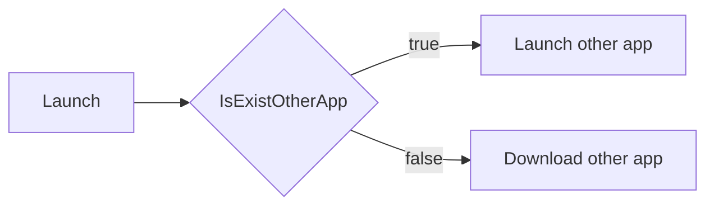

# Uniapp 应用跳转 


贺聂双 / <span text-3>旺工牌</span>   


---
class: text-center
layout: cover
transition: fade
---

# App Schema 


---
class: text-center
layout: cover
transition: fade
---

# app://hello?word=hi 


---
clicks: 4
---


<h1>
  Uniapp Config 
  <span text-4  v-click='1'>/ manifest.json</span> 
</h1>


<div v-click='2'>


```js {all|all|8-11|13-17|all}{lines:true}
{
  // ...
  "app-plus" : {
    // ...
    "distribute" : {

      // ...
      "android" : {
        // ...
        "schemes" : "mine",
      },

      "ios" : {
        // ...
        "urltypes" : "mine",
        "urlschemewhitelist" : "other"
      }

    }
  }
}
```

</div>


---
class: text-center
layout: cover
transition: fade
---


<div
  v-motion
  :initial="{ x: 0 }"
  :enter="{ x: 0 }"
  :click-1="{ x: -120 }"
  :leave="{ x: -120 }"
>
  <h1>Apply</h1>
</div>

<div v-click="1" absolute class="left-50% bottom-50%" bottom-20 text-8>Launch</div>
<div v-click="2" absolute class="left-50% bottom-40%" bottom-20 text-8>Receive</div>


---

# Launch


<div v-click="1" class="h-90 flex items-center justify-center">




</div>


---


<h1>
  Launch 
  <span text-4>/ apis</span> 
</h1>


<div h-90 flex items-center text-10>

<v-clicks>

- [plus.runtime.isApplicationExist](https://www.dcloud.io/docs/api/zh_cn/runtime.html#plus.runtime.isApplicationExist)


- [plus.runtime.launchApplication](https://www.dcloud.io/docs/api/zh_cn/runtime.html#plus.runtime.launchApplication)

</v-clicks>
</div>


---


<h1>
  Launch 
  <span text-4>/ code</span> 
</h1>


<div v-click="1">


```js
const createAppSchemaJumpFn = (params) => {
  const { pname, action, iosMarketUrl, androidMarketUrl } = params
  let isIos = false
  let isAndroid = false
  //  #ifdef APP-PLUS
  isIos = plus.os.name == 'iOS'
  isAndroid = plus.os.name == 'Android'
  //  #endif
  return ({ schema, extra }) => {
    const isExistOtherApp = plus.runtime.isApplicationExist(pname, action)
    if (!isExistOtherApp) {
      plus.runtime.openURL(isIos ? iosMarketUrl : androidMarketUrl)
      return
    }
    if (isAndroid) {
      plus.runtime.launchApplication({ pname, extra })
    }
    if (isIos) {
      plus.runtime.launchApplication({ action: schema })
    }
  }
}
```

</div>


---

<div h-full flex flex-col items-center justify-center>
  <div class="text-16">Thank your watching</div>
  <div w-full text-right mr-80 color-gray-500>
    <span>power by </span>
    <a href="https://github.com/sujianqingfeng/talks">
      sli.dev
    </a>
  </div>
</div>